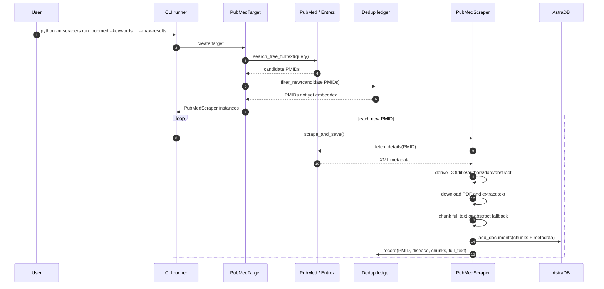
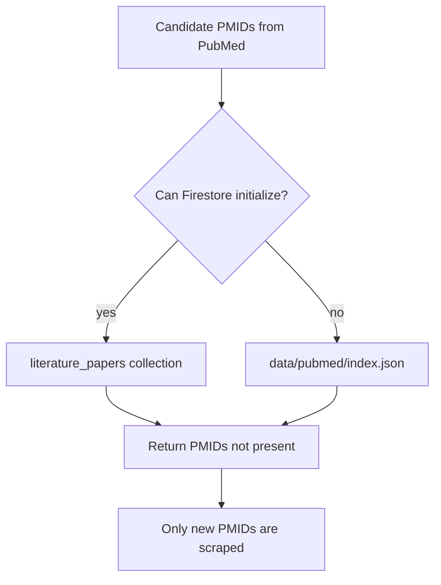
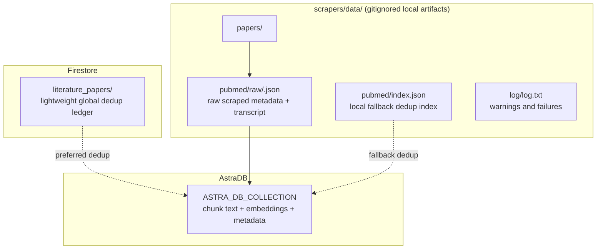
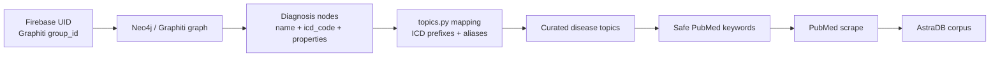
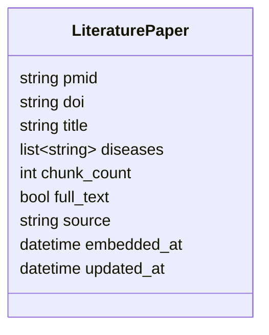

# Backend Scrapers Documentation

`Backend/scrapers` is a standalone literature-ingestion subsystem. It scrapes
external public medical literature, converts article text into chunks, embeds those
chunks with OpenAI embeddings, and stores them in an AstraDB vector collection.

The scraper corpus is global reference knowledge. It is intentionally separate from
the app's per-user document pipeline and from the Neo4j / Graphiti patient knowledge
graph.

At the moment, the only implemented source is PubMed.

## High-Level Purpose

The main backend app extracts a patient's own medical documents into a per-user
knowledge graph. The scraper subsystem solves a different problem: it builds a
shared background literature corpus that can later be retrieved by disease/topic.

That means:

- Patient uploads do not call this package.
- `api/`, `workers/`, and `shared/` do not depend on scraper execution.
- Scraper output is stored in AstraDB, not Neo4j.
- Deduplication is global, so the same paper is not embedded repeatedly.
- Disease tags such as `prostate_cancer` are stored as metadata on chunks for later
  retrieval filtering.

## Architecture Illustration

```mermaid
flowchart LR
    CLI[CLI runner\nrun_pubmed.py / run_topics.py]
    Target[PubMedTarget\nkeywords + max_results + optional disease]
    Search[PubMed Entrez search\nfree full text filter]
    LedgerCheck[Dedup ledger\nFirestore or local JSON]
    Scraper[PubMedScraper]
    Metadata[Entrez metadata\nPMID, DOI, title, authors,\ndate, abstract]
    PDF[paperscraper PDF download]
    Text[pypdf text extraction]
    Fallback[Abstract fallback\nwhen PDF text unavailable]
    Splitter[RecursiveCharacterTextSplitter\n512 chars, 25 overlap]
    Embeddings[OpenAIEmbeddings]
    Astra[AstraDB vector store]
    LedgerWrite[Record ingested paper\nPMID, diseases, chunk count]
    Raw[Raw JSON archive\nscrapers/data/pubmed/raw]
    Logs[Log file\nscrapers/data/log/log.txt]

    CLI --> Target
    Target --> Search
    Search --> LedgerCheck
    LedgerCheck -->|new PMIDs only| Scraper
    Scraper --> Metadata
    Metadata --> PDF
    PDF --> Text
    Text -->|if full text exists| Splitter
    Metadata --> Fallback
    Fallback -->|if PDF missing/empty| Splitter
    Scraper --> Raw
    Splitter --> Embeddings
    Embeddings --> Astra
    Astra --> LedgerWrite
    Scraper --> Logs
```



## Runtime Sequence



## Package Map

| File | Responsibility |
| --- | --- |
| `__init__.py` | Package bootstrap. Loads `Backend/.env`, defines package-local data directories, creates the PubMed index file when missing. |
| `base_target.py` | Abstract target contract. A target describes what should be scraped and returns scraper instances. |
| `pubmed_target.py` | PubMed-specific target containing search keywords, max result count, and optional disease metadata tag. |
| `base_scraper.py` | Abstract scraper workflow: scrape, save raw JSON, convert to LangChain documents, save vectors, record dedup status. |
| `pubmed.py` | PubMed implementation. Searches PubMed, fetches metadata, downloads PDFs, extracts text, chunks content, builds document metadata. |
| `splitter.py` | Text splitting helper using LangChain's `RecursiveCharacterTextSplitter`. |
| `ledger.py` | Dedup adapter. Uses Firestore `literature_papers` when available, otherwise falls back to local `data/pubmed/index.json`. |
| `patient_topics.py` | Reads a patient's Graphiti/Neo4j Diagnosis nodes and maps them to curated disease topics. |
| `topics.py` | Curated disease/topic list and helper functions for mapping ICD codes or diagnosis text to disease tags. |
| `run_pubmed.py` | One-off PubMed scraping CLI for arbitrary keyword searches. |
| `run_patient.py` | Patient-driven PubMed scraping CLI. Resolves disease topics from a user's extracted graph diagnoses. |
| `run_topics.py` | Batch scraping CLI for the curated disease list in `topics.py`. |
| `types.py` | TypedDict contracts for scraped raw records. |
| `log.py` | Simple file logger for scraper warnings/errors. |
| `requirements.txt` | Isolated dependency set for the scraper subsystem. |

## Data Flow Details

### 1. Target creation

Targets describe the desired scrape, not the scraping mechanics.

`PubMedTarget` accepts:

- `keywords`: list of PubMed search terms.
- `max_results`: maximum search results returned by Entrez.
- `disease`: optional stable disease tag stored in each vector chunk's metadata.

Example:

```python
target = PubMedTarget(
    keywords=["prostate cancer", "prostate adenocarcinoma"],
    max_results=10,
    disease="prostate_cancer",
)
```

### 2. PubMed search

`PubMedScraper.search_free_fulltext()` calls `Entrez.esearch()` with:

- `db="pubmed"`
- `sort="relevance"`
- `retmode="xml"`
- `retmax=max_results`
- `term="<keywords> AND free full text[sb]"`

The free-full-text filter reduces the chance of finding papers that cannot provide
usable content, although full PDF downloads can still fail depending on the publisher.

### 3. Dedup filtering

Before any download or embedding work, `PubMedScraper.get_all_possible_elements()`
passes candidate PMIDs to `ledger.filter_new()`.

The ledger chooses one backend per Python process:

- Firestore when `shared.firestore.get_firestore()` works.
- Local JSON fallback when Firebase credentials/configuration are missing or
  unavailable.



Firestore is the intended backend for deployed/cloud usage because local filesystem
state is ephemeral in Cloud Run. The local JSON index is useful for development.

### 4. Scraping one article

For each new PMID, `scrape_and_save()` runs the template workflow from
`BaseScraper`:

1. `_scrape()` fetches metadata and article text.
2. `_save()` writes the raw scraped dictionary to `data/pubmed/raw/<pmid>.json`.
3. `get_documents()` converts the raw dictionary to LangChain `Document` chunks.
4. `_save_vector_docs()` embeds and writes chunks to AstraDB.
5. `_record_scraped()` records the PMID in the ledger.

### 5. Metadata extraction

`PubMedScraper._scrape()` calls `Entrez.efetch()` and derives:

- `title`
- `authors`
- `publicationDate`
- `ref` as DOI URL
- `abstract`
- `transcript` from downloaded PDF text, when available

The raw saved JSON has this shape:

```json
{
  "abstract": "Article abstract text...",
  "authors": "Author One, Author Two",
  "publicationDate": "2024",
  "ref": "https://doi.org/...",
  "title": "Article title",
  "transcript": "Extracted PDF full text..."
}
```

### 6. PDF download and extraction

`get_paper_from_doi()` uses `paperscraper.pdf.save_pdf()` to download a PDF into
`scrapers/data/papers/`.

`get_txt_from_pdf()` uses `pypdf.PdfReader` to concatenate text from all pages.
By default, the temporary PDF is deleted after text extraction.

If text extraction fails, the scraper logs a warning and continues.

### 7. Abstract fallback

`get_documents()` prefers full PDF text:

```python
content = transcript or abstract
```

If full text is unavailable, the abstract is still chunked and embedded. This keeps
the corpus useful even when publisher PDF access fails.

The chunk metadata includes:

```python
{
    "abstract": "...",
    "authors": "...",
    "publicationDate": "...",
    "title": "...",
    "ref": "https://doi.org/...",
    "source": "pubmed",
    "pmid": "...",
    "disease": "prostate_cancer",
    "full_text": True
}
```

### 8. Chunking

`splitter.py` uses:

- `chunk_size=512`
- `chunk_overlap=25`
- `length_function=len`
- `is_separator_regex=False`

Each chunk becomes one LangChain `Document` with identical article-level metadata.

### 9. Vector storage

`BaseScraper._save_vector_docs()` creates an `AstraDBVectorStore` with:

- `OpenAIEmbeddings(api_key=os.getenv("OPEN_AI_API"))`
- `ASTRA_DB_API_ENDPOINT`
- `ASTRA_DB_TOKEN`
- `ASTRA_DB_NAMESPACE`
- `ASTRA_DB_COLLECTION`

Then it calls:

```python
vector_store.add_documents(documents=documents)
```

The Astra collection embedding dimension must match the embedding model used by
LangChain's default `OpenAIEmbeddings` configuration.

### 10. Ledger write

`PubMedScraper._record_scraped()` calls:

```python
ledger.record(
    pmid,
    doi=...,
    title=...,
    disease=...,
    chunk_count=len(documents),
    full_text=...,
    source="pubmed",
)
```

With Firestore enabled, this writes to the global `literature_papers` collection.
With the local fallback, it appends the PMID to `data/pubmed/index.json`.

## Storage Illustration



## Environment Configuration

Add these values to `Backend/.env` or another environment loaded before execution.
The package loads `Backend/.env` automatically from `scrapers/__init__.py`.

```bash
OPEN_AI_API=sk-...
ASTRA_DB_API_ENDPOINT=https://<db-id>-<region>.apps.astra.datastax.com
ASTRA_DB_TOKEN=AstraCS:...
ASTRA_DB_NAMESPACE=default_keyspace
ASTRA_DB_COLLECTION=health_ai

# Optional, but recommended by NCBI.
NCBI_ENTREZ_EMAIL=you@example.com
NCBI_API_KEY=...

# Required only for patient-driven scraping.
NEO4J_URI=neo4j+s://...
NEO4J_USER=neo4j
NEO4J_PASSWORD=...
NEO4J_DATABASE=neo4j
```

Important naming note: this package currently uses `OPEN_AI_API`, not
`OPENAI_API_KEY`. The name mirrors the original project it was ported from.

## Installation

Install scraper dependencies from the `Backend/` directory into your active Python
environment:

```bash
pip install -r scrapers/requirements.txt
```

These dependencies are intentionally separate from the rest of the backend.

## Running the Scrapers

Run commands from `Backend/` so `scrapers` and `shared` are importable as packages.

### One-off keyword scrape

```bash
python -m scrapers.run_pubmed --keywords nutrition health --max-results 3
```

This searches PubMed for `nutrition health`, filters out already-ingested PMIDs,
then embeds up to three new papers.

### Curated disease scrape

```bash
python -m scrapers.run_topics --max-results 5
```

This iterates every topic in `topics.DISEASE_TOPICS`.

To scrape one disease:

```bash
python -m scrapers.run_topics --disease prostate_cancer --max-results 10
```

Known disease tags currently include:

- `prostate_cancer`
- `breast_cancer`
- `type2_diabetes`
- `hypertension`

## Curated Disease Topics

`topics.py` stores the corpus taxonomy in code so changes are reviewable in git.

Each topic contains:

| Field | Meaning |
| --- | --- |
| `disease` | Stable slug used in vector metadata and later retrieval filters. Do not rename casually. |
| `label` | Human-readable disease name. |
| `icd_prefixes` | ICD-10 prefixes for mapping structured diagnoses. |
| `aliases` | Lowercase free-text diagnosis substrings, including German terms. |
| `keywords` | PubMed query terms used during scraping. |

The helper functions are:

- `disease_for_icd(icd_code)`: maps ICD-10 prefixes to a disease tag.
- `disease_for_text(text)`: maps diagnosis text to a disease tag using aliases.
- `diseases_for_diagnosis(name, icd_code)`: prefers ICD mapping, then text mapping.

## Patient-Driven Scraping

The patient-driven flow uses the existing Graphiti patient graph to decide which
PubMed topics to scrape.

The backend ingestion worker stores patient facts in Neo4j through Graphiti with:

```text
group_id = uid
```

For that reason, the first supported patient-driven runner accepts a Firebase
`uid`, not a raw hospital patient number.



Dry-run first to see what the graph resolves to:

```bash
python -m scrapers.run_patient --uid <firebase_uid> --dry-run
```

Then scrape the matching PubMed topics:

```bash
python -m scrapers.run_patient --uid <firebase_uid> --max-results 5
```

The runner does not send the patient's narrative, documents, or private details to
PubMed. It only sends generic curated keywords such as `prostate cancer` after the
local graph diagnosis has been mapped to a disease topic.

If no disease is resolved, update `topics.py` with additional aliases or ICD
prefixes that match the diagnosis terms found in the graph.

## Dedup Ledger Details

The Firestore ledger document is represented by `shared.models.literature_paper`.
One document is stored per unique PMID.



When a paper is discovered again under a different disease:

- The scraper does not re-download the paper.
- The scraper does not re-embed its chunks.
- Firestore appends the new disease tag with `ArrayUnion`.

This keeps the vector store from filling with duplicate chunks while preserving the
fact that one paper may be relevant to multiple disease topics.

## Error Handling

The scraper is resilient to common PubMed/PDF issues:

- Missing DOI, title, authors, date, or abstract return empty strings rather than
  crashing the whole run.
- PDF download or extraction failure is logged and the scraper falls back to the
  abstract when possible.
- If `_scrape()` returns an empty dictionary, `scrape_and_save()` logs that no data
  was found and skips vector insertion.
- If Firestore is unavailable, the ledger falls back to `data/pubmed/index.json`.

Errors and warnings are appended to:

```text
Backend/scrapers/data/log/log.txt
```

## Local Artifacts

All runtime artifacts are under `Backend/scrapers/data/` and are gitignored:

```text
scrapers/data/
  pubmed/
    index.json
    raw/
      <pmid>.json
  papers/
    <temporary downloaded PDFs>
  log/
    log.txt
```

## Extension Guide

To add another literature source, follow the existing target/scraper pattern:

1. Create a target class that extends `BaseTarget`.
2. Create a scraper class that extends `BaseScraper`.
3. Implement `index_file()`, `base_dir()`, `_scrape()`,
   `get_all_possible_elements()`, and `get_documents()`.
4. Reuse `get_text_chunks()` unless the source needs a different chunking policy.
5. Reuse or extend `ledger.py` if deduplication should remain global.
6. Add a small CLI runner like `run_pubmed.py`.
7. Add source-specific metadata fields while preserving the common fields:
   `source`, `ref`, and an external stable ID.

## Troubleshooting

| Symptom | Likely cause | What to check |
| --- | --- | --- |
| `ModuleNotFoundError: scrapers` | Command was not run from `Backend/`. | Run `python -m scrapers.run_pubmed ...` inside `Backend/`. |
| `ModuleNotFoundError: shared` | Same import-path issue, or backend root not on Python path. | Run from `Backend/`. |
| `ModuleNotFoundError: neo4j` | Patient-driven scraping dependencies are not installed. | Run `pip install -r scrapers/requirements.txt`. |
| `run_patient` finds no diagnoses | The user has no extracted Graphiti Diagnosis nodes, or the wrong UID was used. | Confirm the patient's documents reached `EXTRACTED` and use the Firebase UID. |
| `run_patient` finds diagnoses but no topics | The diagnosis terms do not match the curated aliases/ICD prefixes. | Add aliases or ICD prefixes in `scrapers/topics.py`. |
| AstraDB authentication error | Missing or invalid Astra env vars. | Check `ASTRA_DB_API_ENDPOINT`, `ASTRA_DB_TOKEN`, `ASTRA_DB_NAMESPACE`, `ASTRA_DB_COLLECTION`. |
| OpenAI embedding error | Missing `OPEN_AI_API` or incompatible embedding configuration. | Verify the key and the Astra collection vector dimension. |
| Firestore warning followed by local fallback | Firebase credentials are unavailable locally. | Accept the fallback for local runs, or configure Firebase admin credentials. |
| Few or no PDFs extracted | PubMed free-full-text does not guarantee publisher PDF access. | Confirm abstracts are still being embedded through the fallback path. |
| Duplicate papers in searches | Expected PubMed overlap across topics. | Firestore/local ledger should prevent duplicate embedding. |

## Current Limitations

- Only PubMed is implemented.
- Retrieval from the scraped AstraDB corpus is not yet wired into `api/chat.py`.
- PDF extraction quality depends on publisher formatting and `pypdf`.
- The local JSON ledger is not suitable for concurrent or distributed production
  scraping.
- The embedding model is implicit through LangChain's `OpenAIEmbeddings` default.

## Quick Reference

```bash
# From repository root
cd Backend

# Install isolated scraper dependencies
pip install -r scrapers/requirements.txt

# Scrape arbitrary PubMed keywords
python -m scrapers.run_pubmed --keywords nutrition health --max-results 3

# Scrape all curated disease topics
python -m scrapers.run_topics --max-results 5

# Scrape one curated disease topic
python -m scrapers.run_topics --disease prostate_cancer --max-results 10

# Resolve a patient's diagnoses to topics without scraping
python -m scrapers.run_patient --uid <firebase_uid> --dry-run

# Scrape PubMed topics relevant to one patient graph
python -m scrapers.run_patient --uid <firebase_uid> --max-results 5
```
