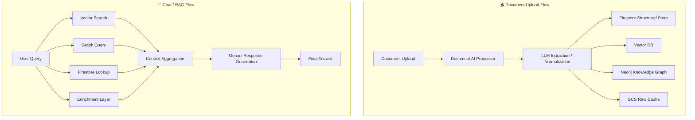
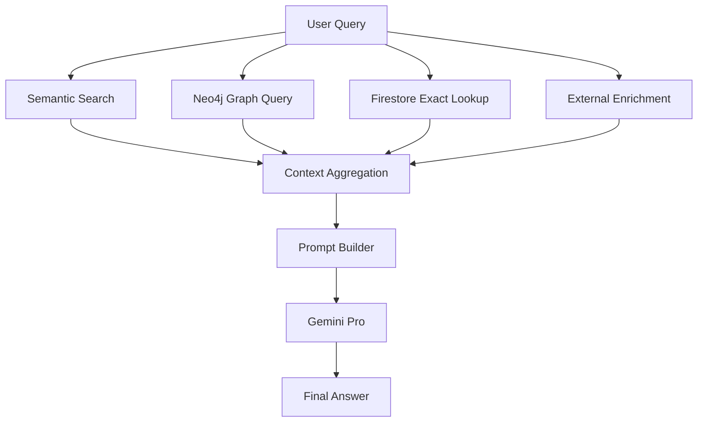
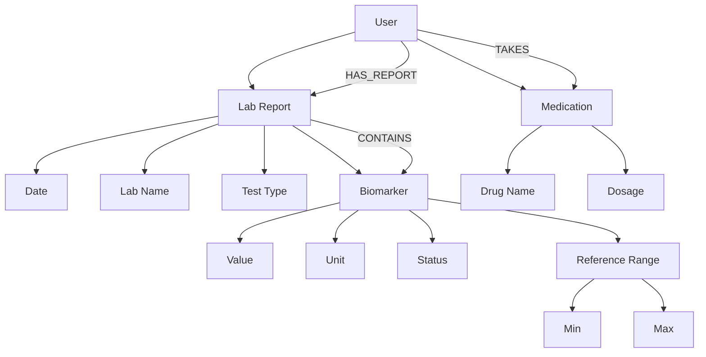
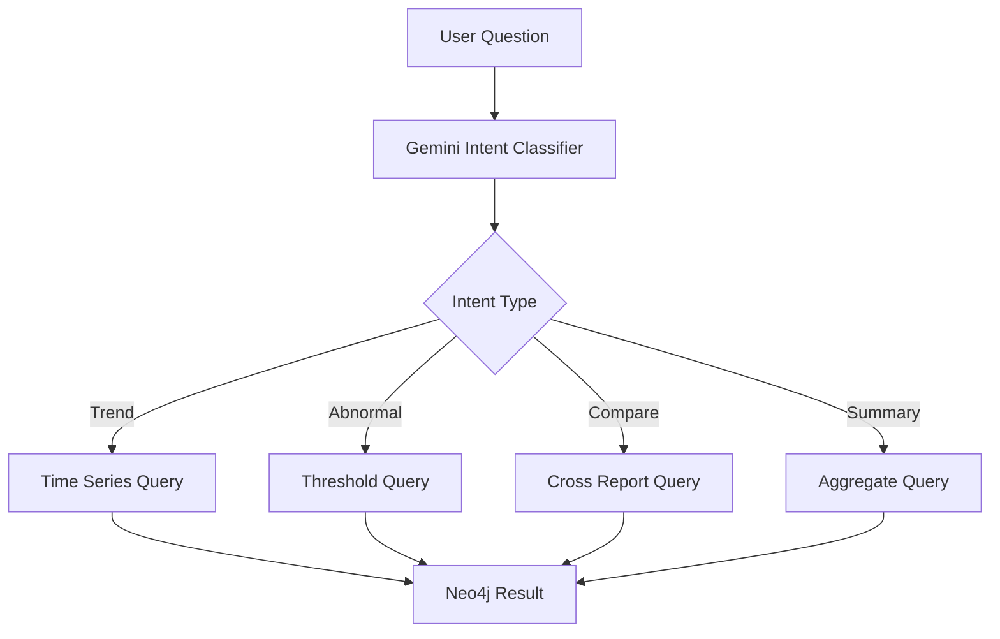
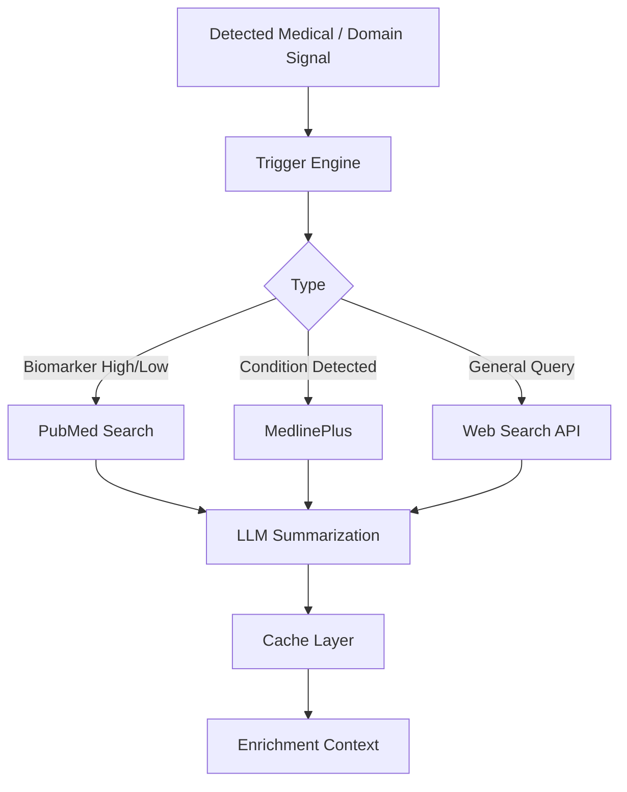
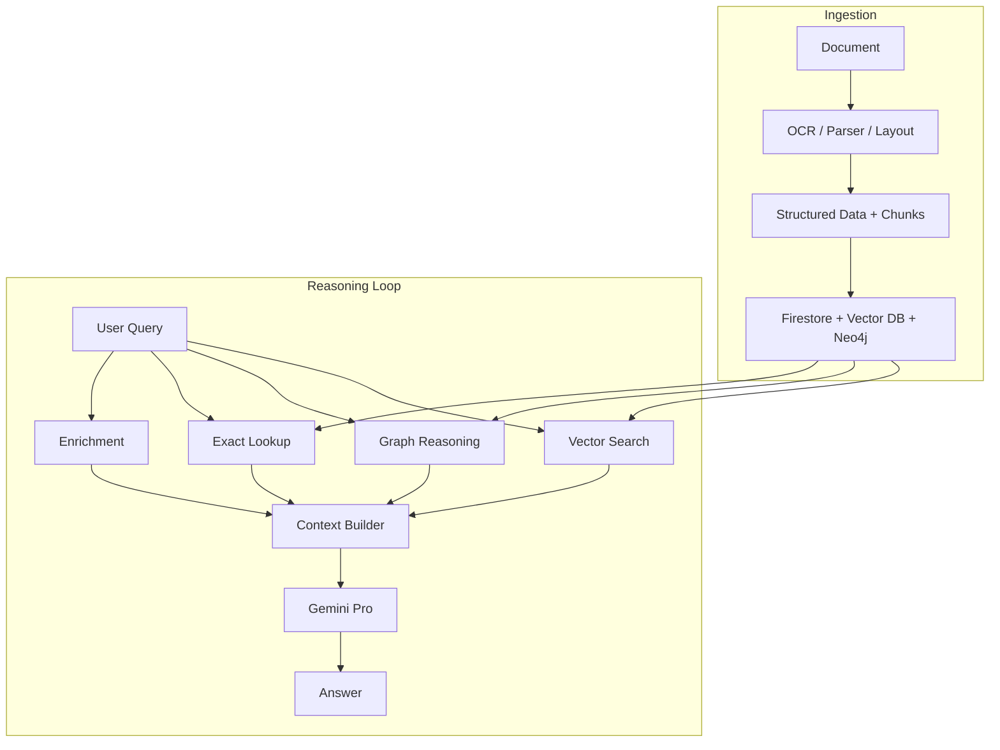

# 🧠 1. Global System Architecture

---
# 🔎 2. RAG Query Pipeline

---

# 🧠 3. Neo4j Knowledge Graph Flow

---

# 📊 4. Graph Query Execution Flow

---

# 🌐 5. External Enrichment Flow

---

# 🧩 6. End-to-End System View (Combined Intelligence Loop)

