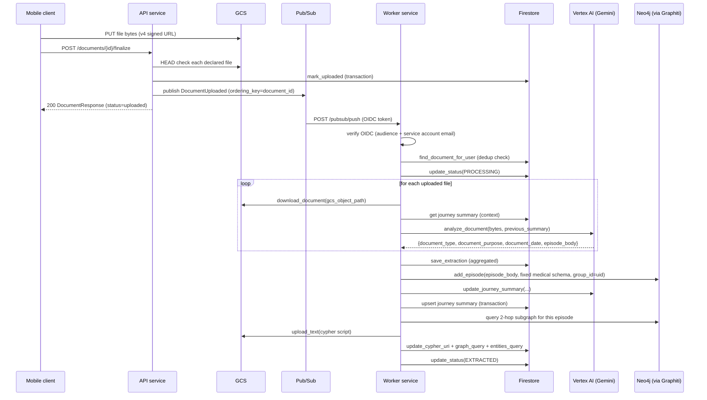
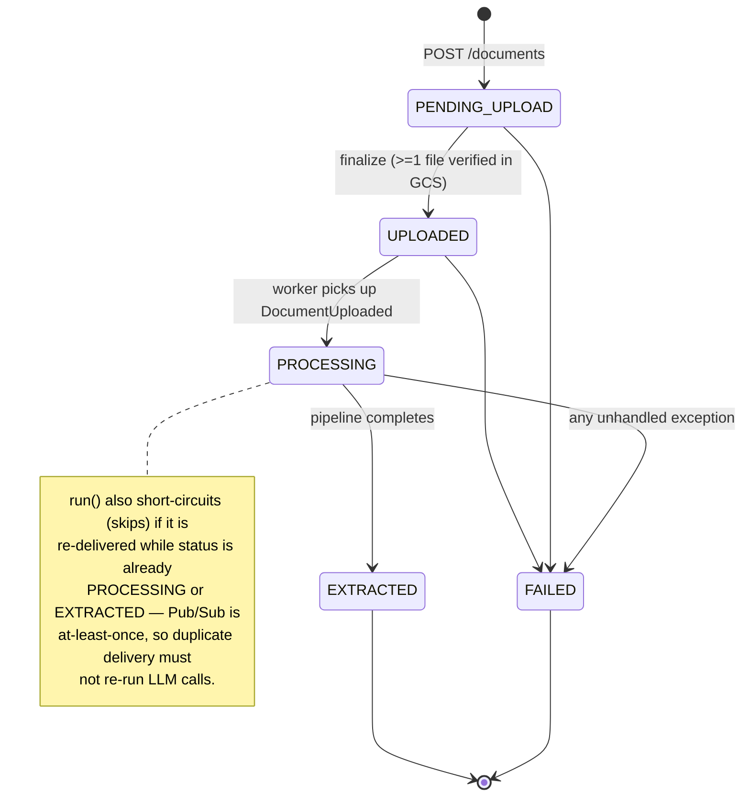
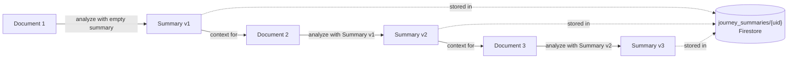
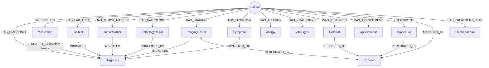
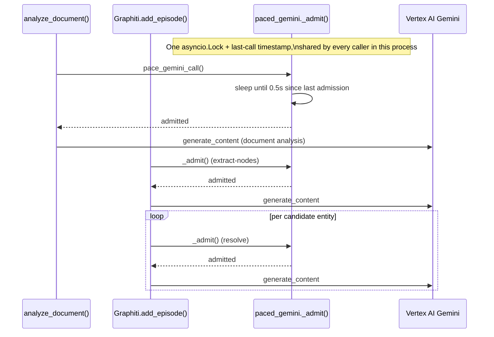

# 01 — Extraction & Knowledge Graph Pipeline

Owner code: [`Backend/workers/`](../../Backend/workers/), shared models in
[`Backend/shared/`](../../Backend/shared/).

## Purpose

Turn one uploaded medical document (lab report, imaging report, referral
letter, pathology report, ...) into:

1. A structured **extraction record** (Firestore) — what kind of document it
   is, its date, its role in the patient's journey, and a rich clinical
   narrative.
2. **Nodes and edges in a per-patient knowledge graph** (Neo4j, via
   [Graphiti](https://github.com/getzep/graphiti)) — entities (diagnoses,
   medications, lab tests, providers, ...) and the relationships between
   them, merged across every document the patient has ever uploaded.
3. A running **patient journey summary** (Firestore) — a short prose summary
   of the patient's case so far, used as context for the *next* document.
4. An exported **Cypher script** (GCS) the frontend can use to render the
   graph for this specific document without constructing Neo4j queries
   client-side.

This is entirely asynchronous. The API returns to the mobile client the
moment a document is finalized; everything described here happens afterwards,
off the request path, in the `ailixir-worker` Cloud Run service.

## End-to-end flow

```mermaid
flowchart TD
    A["Client uploads file bytes\ndirectly to GCS via signed URL"] --> B["POST /documents/id/finalize\n(api/main.py)"]
    B --> C["Verify objects exist in GCS\nmark_uploaded: PENDING_UPLOAD to UPLOADED"]
    C --> D["Publish DocumentUploaded event\n(shared/pubsub.py)"]
    D --> E["Pub/Sub topic: document-uploaded\n(ordered by document_id)"]
    E --> F["Push subscription\nOIDC-signed POST /pubsub/push"]
    F --> G["workers/main.py\nverify OIDC to dispatch by event_type"]
    G --> H["workers/pipeline/document_pipeline.py: run()"]

    subgraph H["document_pipeline.run() — per document"]
        H1["0. Dedup check + status to PROCESSING"] --> H2["1. Download each file from GCS"]
        H2 --> H3["2. Load patient journey summary\n(context for the LLM)"]
        H3 --> H4["3. Gemini multimodal analysis per file\nanalyze_document()"]
        H4 --> H5["4. Aggregate multi-file extractions"]
        H5 --> H6["5. Save Extraction to Firestore"]
        H6 --> H7["6. Graphiti ingest with fixed\nmedical schema to Neo4j"]
        H7 --> H8["7. Update journey summary\n(best-effort, non-fatal)"]
        H8 --> H9["8. Export Cypher script to GCS"]
        H9 --> H10["9. Attach cypher_gcs_uri + graph\nqueries, status to EXTRACTED"]
    end

    H10 --> I["Frontend polls GET /documents/id\nsees status=extracted"]
```



## Sequence diagram



## Document status lifecycle



`soft_delete()` can additionally move a document to a deleted state (`deleted_at`
set) from any status except `PROCESSING` — it is a separate flag, not part of
the forward state machine, so a document can be `EXTRACTED` *and* deleted.

---

## Component 1 — Pub/Sub push receiver (`workers/main.py`)

The worker is **not a public API**. Cloud Run ingress is internal +
load-balancer only, and every push carries a Google-signed OIDC token that
`_verify_oidc_token` checks for:

- correct **audience** (the worker's own Cloud Run URL),
- correct **issuing service account** (`ailixir-pubsub-pusher`, provisioned in
  Terraform — so even a stolen valid-audience token from a *different*
  service account is rejected),
- `email_verified` on the token claims.

`PUBSUB_SKIP_OIDC_VERIFICATION=1` is a local-dev-only escape hatch; Terraform
never sets it in the deployed environment.

Once verified, the envelope is unwrapped (`base64` → JSON), routed by
`event_type` through a small handler table (`_EVENT_HANDLERS`), and today the
only registered event is `DocumentUploaded → document_pipeline.run()`.

**Response code is the retry contract with Pub/Sub:**

| Response | Meaning | When |
|---|---|---|
| `204` | Ack, remove from queue | Handler succeeded, or `event_type` unrecognized (forward-compat: an older worker shouldn't infinite-loop on a newer event) |
| `422` | Ack, but treated as a permanent failure | Message body isn't valid base64 JSON |
| `503` | Nack, retry per backoff policy | A *known-transient* dependency error (Neo4j unreachable, timeout, connection error — see `_RETRYABLE_DEPENDENCY_ERRORS`) |
| `500` | Nack, retry per backoff policy | Any other unexpected exception — still retried, but logged at `ERROR` so on-call sees it, and it eventually reaches the DLQ for inspection |

Terraform's subscription config: `ack_deadline_seconds = 600`, backoff
`10s → 600s`, `max_delivery_attempts = 5` before the message is routed to the
`document-uploaded-dlq` topic.

### Lifespan: no eager connections

The worker's FastAPI `lifespan` deliberately does **not** touch Neo4j/Graphiti
at startup. An earlier version did, to "warm up" the connection — but that
made the Cloud Run readiness probe transitively depend on Neo4j Aura being
reachable. When an Aura Free instance auto-paused, the worker couldn't boot
for days even though nothing in the worker's own code had changed. Now
everything connects lazily on first use; only shutdown does a best-effort
close.

---

## Component 2 — Pipeline orchestrator (`workers/pipeline/document_pipeline.py`)

`run(document_id, uid)` is the single entry point. It is intentionally one
linear function (not a class/DAG framework) — nine sequential steps, each
writing a `processing_step` value to Firestore so the frontend can show live
progress:

`downloading → analyzing → saving_extraction → building_graph → updating_summary → exporting_cypher`

Two design decisions worth calling out:

- **Dedup before doing any work.** Since Pub/Sub is at-least-once, the same
  `DocumentUploaded` event can be delivered twice. `run()` re-reads the
  document and bails out if its status is already `PROCESSING` or
  `EXTRACTED` — this is what makes duplicate delivery cheap instead of
  double-billing Gemini calls and double-writing the graph.
- **The journey-summary update is best-effort.** If Gemini fails at step 7
  (`update_journey_summary`), the exception is caught, logged at `WARNING`,
  and the document still reaches `EXTRACTED` — the extraction and the graph
  are already durably saved and are real value to the user. The only cost is
  that the *next* document's analysis loses this document's contribution to
  the journey context, which self-heals on the next successful summary
  update.
- **Any other exception is terminal for this document.** It's caught once at
  the top level, the document is marked `FAILED` with the error message
  attached, and the exception is re-raised so the worker's retry/DLQ logic
  (see Component 1) still applies at the transport level.

### Multi-file aggregation

A `Document` can have more than one uploaded file (e.g. a lab report plus an
imaging report the user bundled together). Each file gets its own Gemini
call, and `_aggregate_extractions` combines the per-file results
deterministically rather than overwriting fields:

| Field | Aggregation rule |
|---|---|
| `document_type` | First non-empty / non-"Unknown" value, in upload order |
| `document_purpose` | All non-empty purposes, deduplicated, joined with `; ` |
| `document_date` | **Earliest** non-null date — the earliest signal is the most clinically meaningful temporal anchor |
| `episode_body` | All narratives concatenated in upload order, blank-line separated, so Graphiti reads one continuous narrative |

---

## Component 3 — Gemini multimodal extractor (`workers/pipeline/llm/`)

`analyze_document(file_bytes, filename, mime_type, previous_summary)` sends
the **raw file bytes directly** to Gemini (`gemini-2.5-flash` by default) as a
multimodal `Part` — no OCR step in between. This replaced an earlier
Document AI OCR pipeline (see the note at the bottom of this document); Gemini
reads PDFs/images natively and can reason about layout, tables, and
handwriting in one pass.

The model is instructed (`prompts.py::EXTRACTION_PROMPT`) to return strict
JSON with exactly four keys:

```json
{
  "document_type": "Laborbericht | Arztbrief | Pathologiebericht | ...",
  "document_purpose": "one sentence — its role in this patient's journey",
  "document_date": "YYYY-MM-DD or null",
  "episode_body": "one rich clinical narrative paragraph"
}
```

Two things worth highlighting about the prompt design:

- **Entity/edge extraction is explicitly NOT done here.** The prompt asks
  for a *narrative paragraph* that mentions every entity type Graphiti knows
  about (Patient, Diagnosis, Medication, LabTest, ...), but leaves the actual
  structured extraction to Graphiti's own LLM in the next step. This
  separation is what lets a fixed schema (Component 4) drive consistent
  entity merging — the document-analysis LLM's job is just to make sure
  nothing medically relevant is left out of the prose.
- **The previous journey summary is injected as context** (`{summary}` in the
  prompt), so phrases like "PSA changed from 7.6 to 4.2" become possible —
  the model can explicitly reference the patient's known history rather than
  describing each document in isolation.

`update_journey_summary(current_summary, extraction, doc_name)` is a second,
separate Gemini call (`SUMMARY_UPDATE_PROMPT`) that folds the new
extraction into a 3–8 sentence rolling summary — replacing superseded facts
rather than appending forever, so the context fed to future documents stays
bounded.

### The journey-summary feedback loop



This is also what anchors **temporal ordering across out-of-order uploads** —
each document's `reference_time` in Graphiti (Component 4) is the document's
*own* date, not the upload time, so a January lab result is correctly ordered
before a March one even if the patient uploads March first.

Concurrency note: two documents for the same user processed in parallel could
race on `journey_summaries/{uid}`. `upsert_summary` wraps the
read-count/write in a Firestore transaction so `document_count` never drops
an increment, but the summary *text* itself is last-writer-wins by design —
serializing LLM calls across a user's concurrent uploads was judged not worth
the complexity for the current traffic pattern.

---

## Component 4 — Graphiti ingestion with a fixed medical schema (`workers/pipeline/graph/`)

Each document upload becomes **one Graphiti episode**. Graphiti runs its own
internal LLM pass over `episode_body` to extract entities and relationships,
constrained to a **fixed Pydantic schema** (`medical_schema.py`) passed to
`add_episode()` on every call — this is the single decision that makes
cross-document entity merging possible.



14 entity types (core: Patient, Diagnosis, Medication, LabTest, Procedure,
Provider; oncology: PathologyResult, TumorMarker, TreatmentPlan; expanded:
ImagingResult, Symptom, Allergy, VitalSigns, Referral, Appointment) and 20
edge types, each a Pydantic `BaseModel` whose fields become structured
properties on the graph node/edge (e.g. `LabTest.test_value`,
`Diagnosis.icd_code`, `Medication.dosage`). `MEDICAL_EDGE_TYPE_MAP` further
constrains *which* edge types are legal between *which* entity-type pairs, so
Graphiti's extraction can't invent an ad-hoc relationship type per document.

Three things this schema buys, all documented in `builder.py`'s module
docstring:

1. **Cross-document entity merging** — a `Diagnosis` mentioned in three
   different documents resolves to the same node instead of three disjoint
   ones, because the schema and the shared `group_id` give Graphiti a
   consistent target to merge into.
2. **Temporal fact updates** — Graphiti is bi-temporal: an edge has both
   `valid_at`/`invalid_at` (when the fact was true in the real world) and
   ingestion time. A new PSA value doesn't delete the old edge; it expires it
   (`invalid_at` set) and creates a new current one, so history is never
   lost and "current vs. historical" is answerable at read time
   (this is exactly what [doc 02](02_question_answering_pipeline.md)'s
   answerer relies on).
3. **Consistent relationship types regardless of document type** — a referral
   letter and a lab report both produce edges from the same 20-type
   vocabulary, so Component 02's retrieval doesn't need document-type-specific
   logic.

### Patient identity anchoring

Every episode body is prefixed with a fixed sentence:
`"Patient ID: {uid}.\n"` (`_build_patient_header`). Without this, two
documents that refer to the same person differently — abbreviations, German
vs. English name order, a title — could resolve to two separate `Patient`
nodes that never merge. The header, combined with `group_id=uid` scoping
every call, guarantees exactly one `Patient` node per Firebase user.

### Reference time, not ingestion time

`_parse_doc_date` tries seven date formats (ISO, German `DD.MM.YYYY`, US,
long-form English/German, ...) pulled from the LLM's `document_date` field,
falling back to "now" only if nothing parses. This value becomes Graphiti's
`reference_time` — the graph's temporal ordering reflects when things
*actually happened medically*, independent of upload order.

---

## Component 5 — Neo4j / Graphiti connection (`workers/connections/`)

`graphiti_client.py` builds one process-wide `Graphiti` instance wrapping:

- `Neo4jDriver` — bolt/Aura connection (`NEO4J_URI/USER/PASSWORD/DATABASE`),
- `PacedGeminiClient` — Graphiti's LLM calls (entity/edge extraction,
  resolution),
- `GeminiEmbedder` — 768-dim embeddings (`text-embedding-005`) for hybrid
  search,
- `PacedGeminiRerankerClient` — cross-encoder rerank calls Graphiti makes
  internally during entity resolution.

`build_indices_and_constraints()` runs once (idempotent, guarded by
`_indices_built`) on first use per process, not at startup (see the Component
1 lifespan note).

### Why every Gemini call in this service is paced

A single content-rich clinical document can trigger **30–50 Gemini calls in
10–15 seconds** inside one `add_episode()` — one extract-nodes call, one
resolve-with-llm call *per candidate entity*, one extract-edges call, one
resolve *per candidate edge*, one rerank call per candidate edge. The Vertex
per-project RPM quota for the model is in the low hundreds, so an unpaced
burst reliably trips `RateLimitError` and fails the whole document.



`paced_gemini.py`'s admission queue (`_MIN_INTERVAL_S = 0.5s` → ~120 RPM
ceiling) serializes only the *admission moment*, not the round-trip itself —
concurrent calls can still be in flight together, so throughput isn't
serialized to one-at-a-time, only the rate of new calls starting is capped.
The same module also **floors `max_output_tokens` to 65536** for Graphiti's
edge-extraction call: Gemini 2.5's internal "thinking" tokens count against
the output budget, and Graphiti's hardcoded 16384-token cap left too little
room for the actual JSON once a dense clinical prompt made the model think
for ~15,900 tokens — the JSON response was getting cut off mid-string.
Overriding the floor fixed truncated-JSON failures without touching
Graphiti's own code.

The API's chat pipeline ([doc 02](02_question_answering_pipeline.md)) has its
**own, separate** pacer (`api/chat_pipeline/pacer.py`, 0.3s interval) — the
two Cloud Run services are separate processes and can't share an in-memory
lock, and chat's call volume/latency profile is different enough (3 calls per
request vs. ~50) to warrant a different rate.

---

## Component 6 — Cypher exporter (`workers/pipeline/graph/exporter.py`)

After the graph is built, `generate_and_upload` walks **2 hops** out from the
episode's `Episodic` node in Neo4j, collects the nodes/edges belonging to
*this document specifically* (as opposed to the patient's whole graph),
strips Graphiti-internal properties (embeddings, `group_id`, temporal
bookkeeping fields), renders a self-contained `.cypher` script, and uploads it
to the `GCS_CYPHER_BUCKET`. The resulting `gs://` URI is stored on the
Firestore document record; `api/main.py` turns it into a short-lived signed
download URL (`cypher_download_url`) so the mobile client can fetch it
directly.

Two ready-to-use Cypher queries are also computed and stored at this stage
(`update_graph_queries`), so the frontend never has to construct Neo4j
queries itself:

- `graph_query` — the full entity graph for the patient (`group_id`-scoped;
  identical for every document belonging to the same user).
- `entities_query` — entities linked to *this document's* episode only.

---

## Error handling & retry taxonomy

`shared/retryable_errors.py` is the single source of truth for "is this
failure transient." It's consumed in three places: the worker's Pub/Sub push
handler (→ 503 vs 500), the API's chat endpoint, and (implicitly, by
`document_pipeline.py`'s top-level catch) here.

| Category | Examples | Treated as |
|---|---|---|
| Transient infra | `Neo4jServiceUnavailable`, `Neo4jSessionExpired`, `ConnectionError`, `TimeoutError` | Retryable — Pub/Sub redelivers |
| Vertex transient | `ResourceExhausted` (429), `ServiceUnavailable` (503), `DeadlineExceeded` (504), `InternalServerError` (500), `GraphitiRateLimitError` | Retryable |
| Everything else | Bad data, programming errors, permanent auth failures | Terminal for this delivery attempt — document is marked `FAILED`; the HTTP-level 500 still lets Pub/Sub retry a few times before DLQ, in case the "everything else" bucket was itself a transient blip in a dependency the tuple doesn't yet cover |

The tuple is kept deliberately **narrow** — the module docstring is explicit
that misclassifying a genuine logic bug as retryable would cause a silent
infinite retry loop with the real failure never surfacing to an operator.

---

## Legacy pipeline (superseded, not part of the current flow)

`workers/pipeline/ocr/` (`document_ai.py`, `extractor.py`) and the root-level
`Backend/test_pipeline.py` implement an **older Document AI OCR-based**
extraction path. It is no longer wired into `document_pipeline.py` or
`workers/main.py`, Document AI's Terraform resources have been removed (see
`workers/terraform/main.tf` and `variables.tf`, both explicitly comment on the
removal), and `google-cloud-documentai` is not in
`workers/requirements.txt`. The `Extraction` Firestore model and
`ExtractionResponse` API schema still carry the old OCR fields
(`raw_text`, `extracted_fields`, `confidence_score`) purely for backward
compatibility with documents extracted before the Gemini-multimodal migration
— new extractions leave them `null`. `workers/pipeline/graph/prompts.py` is
similarly dead code from the same era (nothing imports it). These files are
left in place for historical reference but should not be treated as
describing current behavior.
