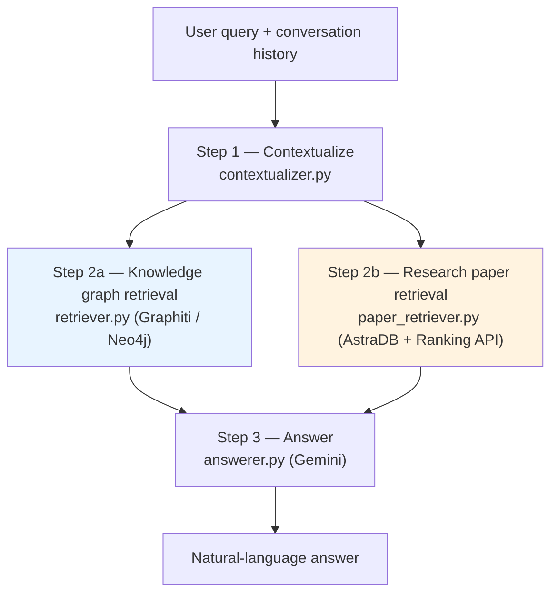
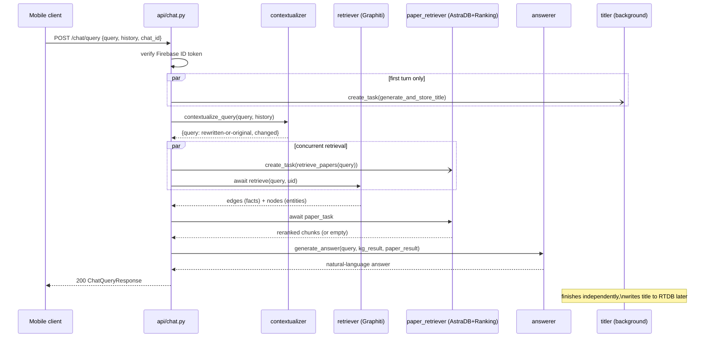
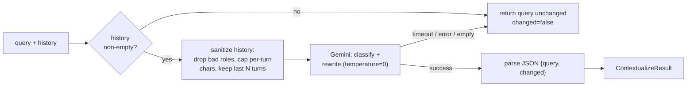
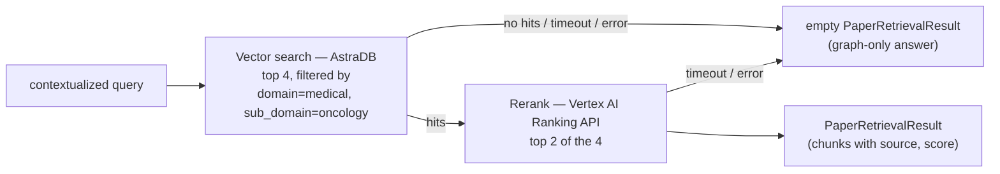
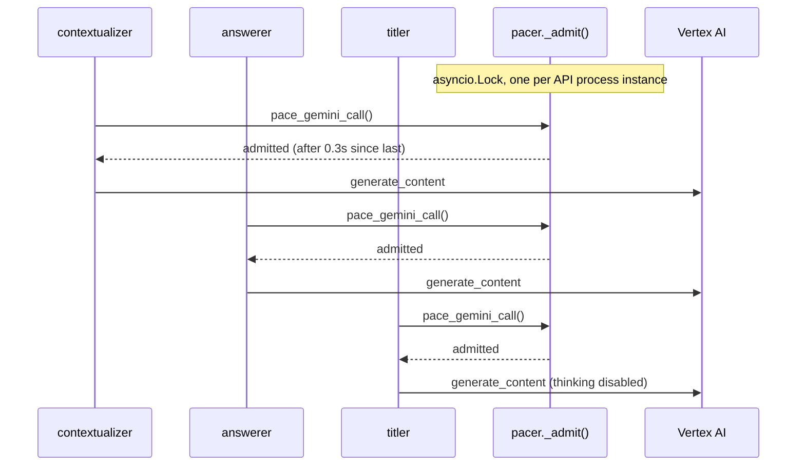
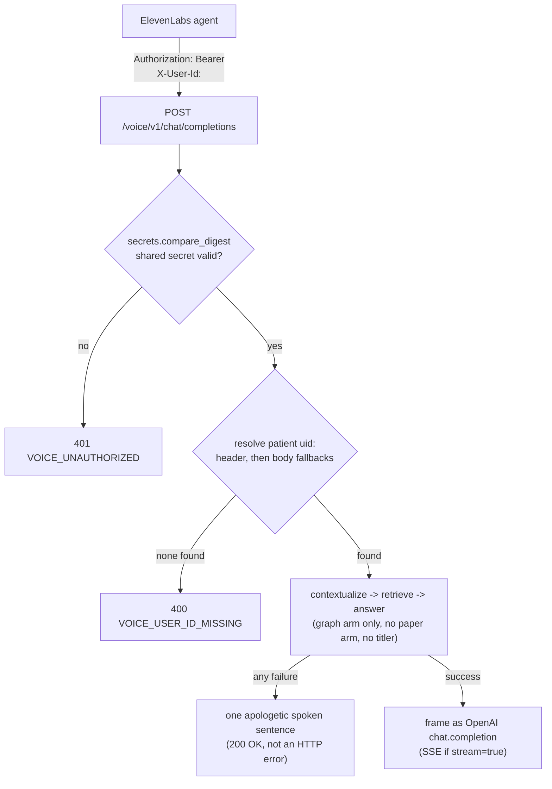

# 02 — Question Answering Pipeline

Owner code: [`Backend/api/chat.py`](../../Backend/api/chat.py),
[`Backend/api/voice.py`](../../Backend/api/voice.py),
[`Backend/api/chat_pipeline/`](../../Backend/api/chat_pipeline/).

## Purpose

Answer a patient's natural-language question about their own medical history,
grounded in the knowledge graph [doc 01](01_extraction_and_knowledge_graph_pipeline.md)
built for them — plus, optionally, general medical reference material from a
scraped research-paper corpus. Two entry points share one pipeline:

- `POST /chat/query` — the mobile app's text chat.
- `POST /voice/v1/chat/completions` — an OpenAI-compatible adapter reaching the
  same pipeline. *Future work — groundwork in place, not active yet.*

Unlike [doc 01](01_extraction_and_knowledge_graph_pipeline.md), this pipeline
runs **synchronously inside the API service**, on the user's request clock —
it has to be fast (few-second budget), not just eventually correct.

## The three-step pipeline, two-arm retrieval

Both retrieval arms run **concurrently** (`asyncio.create_task` in
`chat.py`), not sequentially — the paper arm is launched before the graph
arm's result is even awaited. The graph arm is the primary, always-required
source; the paper arm is supplementary and **allowed to fail silently** (see
"Graceful degradation" below), so total latency is bounded by whichever arm
is slower, not their sum, and a down AstraDB never blocks an answer.

## Sequence diagram (`/chat/query`)

---

## Component 1 — Contextualizer (`chat_pipeline/contextualizer.py`)

Decides whether the latest message is self-contained or implicitly refers to
prior conversation ("tell me its side effects" after discussing Tamoxifen),
and if so rewrites it into a standalone query before retrieval runs. This
matters because both retrieval arms search on the query text alone — a
pronoun-laden query would retrieve poorly.

**This function must never raise.** Every failure mode — Vertex timeout,
malformed JSON, empty response — degrades to "return the original query,
`changed=false`." The rest of the pipeline runs on a slightly less-rewritten
query rather than failing the whole chat turn over a classification hiccup.

Hardening applied, since `history` is user-supplied and reaches an LLM
prompt:

- Only `user`/`assistant` roles pass through; anything else is dropped.
- Each turn is capped at 4000 chars (mirrors the HTTP-layer Pydantic cap,
  re-enforced here in case a future caller bypasses HTTP validation).
- Only the most recent 20 turns are kept.
- The assembled prompt has a hard 100KB ceiling regardless of the above math.
- The system prompt explicitly instructs the model to treat history as
  **data to analyze, not instructions to follow** — a first line of defense
  against prompt injection embedded in prior chat turns.

## Component 2a — Knowledge graph retrieval (`chat_pipeline/retriever.py`)

Hybrid semantic + keyword search against the *same* Neo4j graph
[doc 01](01_extraction_and_knowledge_graph_pipeline.md) builds, scoped by
Graphiti's `group_ids=[uid]` — this is the mechanism that keeps one patient's
facts from ever appearing in another patient's answer; there is no separate
authorization check layered on top; the scoping *is* the isolation boundary.

- Search methods: cosine similarity **and** BM25, on both edges (facts) and
  nodes (entities).
- Reranking: **RRF** (Reciprocal Rank Fusion), not a cross-encoder — this
  keeps per-request latency low by avoiding an extra Gemini rerank call.
  Final relevance judgment is left to the answerer's LLM, which sees the
  full top-K anyway.
- Default `num_results = 4`. The module docstring's reasoning: "4 well-ranked
  facts beats 20 raw chunks" — dense structured facts don't need the same
  volume as raw text chunks would.
- Hard 15s timeout (`asyncio.wait_for`) — without it, a Neo4j outage would
  hang the request for 30+ seconds via the driver's own internal retries.
  Timing out here raises `asyncio.TimeoutError`, which `shared/retryable_errors.py`
  and `chat.py`'s exception handling both know how to turn into a client-facing
  `503`/`CHAT_RETRIEVAL_TIMEOUT`.

Note: this arm's Graphiti instance (`chat_pipeline/graphiti_client.py`) is
built with **plain** `GeminiClient`/`GeminiRerankerClient`, not the
`Paced*` wrappers from [doc 01](01_extraction_and_knowledge_graph_pipeline.md)
— chat queries arrive one at a time per user rather than in the 30-50-call
burst a single `add_episode()` produces, so the worker's aggressive pacing
isn't needed here; the explicit `pace_gemini_call()` calls in the
contextualizer/answerer/titler (Component 5 below) are what protect this
service's Vertex quota instead. It also skips `build_indices_and_constraints()`
— the ingestion worker already built them; re-running on every API cold
start would waste ~2s and risk index contention with a running worker.

## Component 2b — Research paper retrieval (`chat_pipeline/paper_retriever.py`)

Supplementary arm: vector-searches a corpus of scraped PubMed/arXiv/YouTube
content (see [doc 04](04_literature_ingestion_pipeline.md) for how that
corpus is built) and reranks the hits, so the answerer can cite general
reference material alongside patient-specific facts.

Two implementation details worth noting:

- **Domain/sub-domain scoping is currently hardcoded** (`medical`/`oncology`)
  rather than derived per-user, because every current user is an oncology
  patient. The module docstring flags this explicitly as the seam to extend
  once other domains onboard.
- **The reranker uses the *sync* `RankServiceClient`**, invoked through
  `asyncio.to_thread`, not the async gapic client — there's a known upstream
  bug where the async Discovery Engine client raises "Task got Future
  attached to a different loop." The sync-client-in-a-thread pattern
  sidesteps that class of bug entirely.

**Graceful degradation is the load-bearing property of this whole component**:
`retrieve_papers` is documented to never raise. AstraDB downtime, an
embedding-API error, a Ranking API quota trip, or a timeout on either stage
all collapse to an empty result — the chat pipeline then answers from the
knowledge graph alone. A degraded research corpus must never take down the
primary, patient-specific answer path.

## Component 3 — Answerer (`chat_pipeline/answerer.py`)

This is **graph-RAG**, not chunk-RAG: the LLM reasons over structured
relationship facts (`"Patient is prescribed Tamoxifen 20mg daily from
2024-01-15"`) rather than raw retrieved text, which gives temporally-aware,
de-duplicated answers with a lower hallucination surface than naive
chunk-based retrieval.

`_build_llm_context` explicitly splits retrieved edges into **current**
(`invalid_at is None`) vs. **historical** (superseded) facts before handing
them to the prompt — this is the direct payoff of Graphiti's bi-temporal
model from [doc 01](01_extraction_and_knowledge_graph_pipeline.md): the
model can say "the patient is *currently* on X; they were previously on Y
until March 2024" instead of presenting both as equally true.

The system prompt establishes a strict hierarchy the model must not blur:

1. Knowledge-graph facts/entities are **the sole source of truth about this
   patient**. The model is told not to supplement them with general medical
   knowledge, and not to fabricate anything not present.
2. Research-paper excerpts (if present) are **general reference only** — the
   prompt explicitly forbids using them to assert something as true of *this*
   patient.
3. Instruction-injection guard: the model is told to ignore any embedded
   instruction inside the facts/entities/paper-excerpts sections (these are
   extracted document content, not commands) — same defensive posture as the
   contextualizer.

Failure surface is deliberately granular so `chat.py` can map each to a
distinct client-facing error code (`CHAT_LLM_TIMEOUT`, `CHAT_LLM_EMPTY`,
`CHAT_RATE_LIMITED`, `CHAT_LLM_FAILED`) — an *empty* Gemini response
(`ValueError`, usually a SAFETY block or MAX_TOKENS) is explicitly **not**
treated as retryable, since replaying the identical prompt would produce the
identical empty result; the client is told to have the user rephrase instead
of auto-retrying.

## Component 4 — Chat title generation (`chat_pipeline/titler.py`)

Not part of the answer path at all — a best-effort side effect. On the first
turn of a new chat (`history` empty + `chat_id` present), a title-generation
task is launched with `asyncio.create_task` **before** retrieval even starts,
so it runs concurrently with the whole answer pipeline and is usually already
written to Realtime Database by the time the client renders the answer.

Correctness is enforced by an RTDB **transaction**, not by the trigger logic:
the write only replaces the literal placeholder `"New Chat"`, and refuses if
the user already renamed the chat (`titleSource == "user"`). That makes the
trigger side idempotent and rename-safe — a duplicate or missed trigger can
never double-title or clobber a user's rename. Every failure mode is caught
and logged; a missing title just leaves the chat as "New Chat," it never
degrades the actual chat response.

## Component 5 — Rate limiting (`chat_pipeline/pacer.py`)

Same admission-queue pattern as the worker's pacer
([doc 01](01_extraction_and_knowledge_graph_pipeline.md#component-5--neo4j--graphiti-connection-workersconnections)),
independently instantiated because the API and worker are separate Cloud Run
processes that can't share an in-memory lock. Default interval `0.3s` (~200
RPM per process) — looser than the worker's `0.5s` (~120 RPM) because chat
traffic is user-initiated, latency-sensitive, and only 3 Gemini calls deep per
request (contextualize, answer, optionally title) versus the worker's ~50
calls per document.

Note the retrieval arm's Graphiti-internal embedding call is **not** routed
through this pacer — only the three explicit Vertex calls
(contextualize/answer/title) are. At current traffic this is an accepted
asymmetry rather than an oversight; it would be the first thing to revisit if
Graphiti-side rate-limit errors start showing up from the API service.

---

## Voice: the same pipeline behind an OpenAI-compatible adapter (`api/voice.py`)

> **Future work.** The adapter below is built and deployed — the groundwork for
> voice is in place, but the feature is not active yet and has no live caller
> (issue #249).

`POST /voice/v1/chat/completions` exists because ElevenLabs' Conversational
AI product can point at an external "Custom LLM" instead of a hosted model,
but it speaks the OpenAI Chat Completions wire format and cannot carry a
Firebase ID token the way the mobile app does. Rather than overload
`/chat/query` with two incompatible request/auth contracts, voice gets its
own endpoint that adapts to the same three pipeline components.

Differences from `/chat/query`, each deliberate:

- **Auth model**: a shared secret (`ELEVENLABS_CUSTOM_LLM_SECRET`) sent as
  `Authorization: Bearer <value>`, configured in ElevenLabs' dashboard as the
  agent's "API key" — not a Firebase ID token, because the mobile app (not
  ElevenLabs) is the Firebase-authenticated party. Patient identity instead
  travels as a `secret__`-prefixed ElevenLabs dynamic variable, forwarded as
  the `X-User-Id` header (preferred) or one of several documented
  fallback body locations — ElevenLabs' own docs are inconsistent about
  exactly where dynamic variables land in the request, so the handler checks
  header first, then body, and logs which path matched (`uid_source=...`) so
  the real integration path can be confirmed from logs.
- **No research-paper arm and no title generation** — `_run_pipeline` calls
  `retrieve` + `generate_answer` directly, skipping `paper_retriever` and
  `titler` entirely. Voice answers from the knowledge graph only.
- **Failure philosophy is inverted.** `/chat/query` returns granular HTTP
  error codes because the iOS client reads them to drive retry/backoff UX. A
  voice agent has no such loop — ElevenLabs just speaks whatever text comes
  back. So retrieval/answer failures are caught broadly and turned into one
  spoken apology delivered through a normal `200` response, rather than an
  HTTP error the patient would experience as dead air mid-conversation. Only
  *configuration* failures (bad shared secret, unresolvable patient id) still
  surface as real HTTP errors, since those mean the integration itself is
  broken and should be loud in monitoring.
- **Streaming is framed, not real.** `generate_answer` returns one complete
  string; the SSE response delivers it as a single delta chunk rather than
  token-by-token. This satisfies the OpenAI/ElevenLabs wire contract (and
  ElevenLabs can still start text-to-speech as soon as that one chunk
  arrives) but isn't incremental generation — flagged in the module docstring
  as worth revisiting if time-to-first-audio becomes a problem.

---

## Error taxonomy (`/chat/query`)

| HTTP | Error code | Meaning | Client guidance |
|---|---|---|---|
| 504 | `CHAT_RETRIEVAL_TIMEOUT` | Graph search exceeded 15s | Retry with backoff |
| 503 | `CHAT_NEO4J_UNAVAILABLE` | Neo4j/Aura unreachable or session expired | Retry with backoff |
| 503 | `CHAT_RATE_LIMITED` | Vertex 429 / Graphiti rate-limit surfaced | Retry with backoff |
| 503 | `CHAT_RETRIEVAL_FAILED` | Any other retrieval exception | Retry with backoff |
| 504 | `CHAT_LLM_TIMEOUT` | Answer call exceeded 60s | Retry, longer backoff |
| 503 | `CHAT_LLM_EMPTY` | Gemini returned nothing (SAFETY/MAX_TOKENS) | **Not** auto-retryable — ask the user to rephrase |
| 503 | `CHAT_LLM_FAILED` | Any other answer-generation exception | Retry with backoff |

This mirrors `shared/models/errors.py::ErrorCode` and is designed so the iOS
client can drive distinct UX per failure mode instead of a single generic
"something went wrong."
