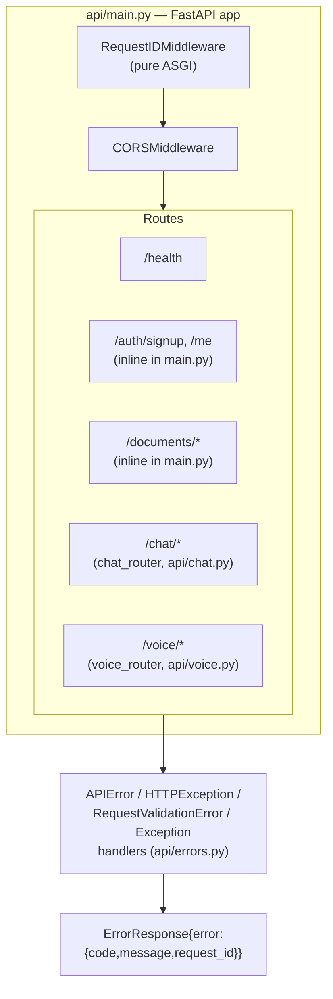
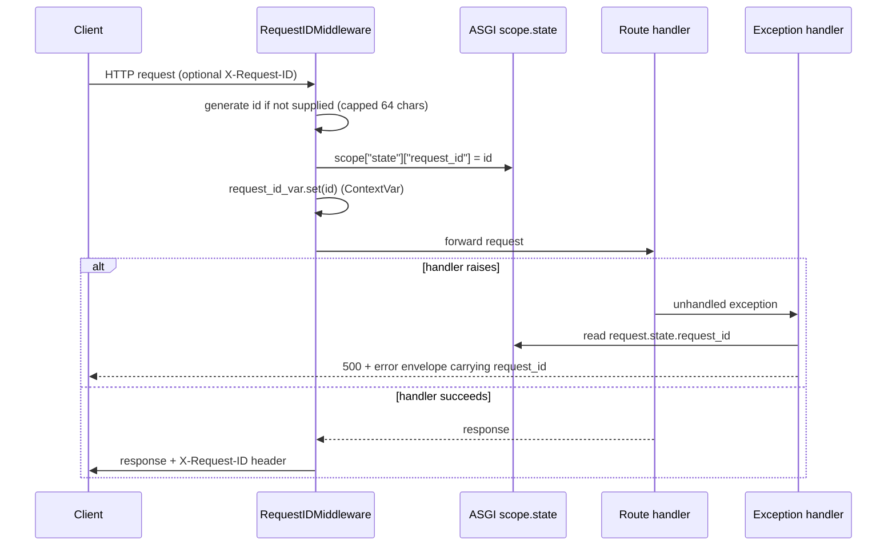
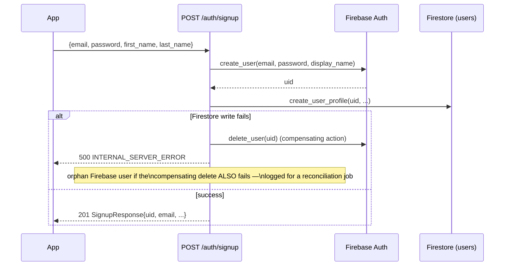

# 03 — API Service Architecture

Owner code: [`Backend/api/`](../../Backend/api/) (`main.py`, `auth.py`,
`errors.py`, `middleware.py`, `chat.py`, `voice.py`), shared code in
[`Backend/shared/`](../../Backend/shared/).

## Purpose

The single public entry point for the mobile client (and, indirectly,
ElevenLabs): auth, document upload lifecycle, and the question-answering
pipeline ([doc 02](02_question_answering_pipeline.md)). Deployed as the
`ailixir-backend` Cloud Run service — see
[doc 05](05_infrastructure_and_deployment.md) for the deployment topology.

Two things this service deliberately does **not** do:

- **Never streams file bytes through itself.** Clients upload/download
  directly to/from GCS using time-limited v4 signed URLs. This keeps the API
  stateless and its bandwidth bill bounded regardless of document size.
- **Never runs the extraction/knowledge-graph pipeline.** That's the worker
  service's job ([doc 01](01_extraction_and_knowledge_graph_pipeline.md)),
  triggered by a Pub/Sub event this service publishes after upload finalize.

## App structure



`chat` and `voice` are mounted as `APIRouter`s with prefixes; `/auth` and
`/documents` are defined directly on `app` in `main.py` since they're tightly
coupled to the request/response models declared right above them in the same
file.

## Middleware: request-id propagation (`api/middleware.py`)

Every inbound request gets an id (`req_<16 hex chars>`), echoed back via the
`X-Request-ID` response header and made available to every log line emitted
while handling that request, via a `contextvars.ContextVar`.

This is implemented as a **pure ASGI middleware**, not Starlette's
`BaseHTTPMiddleware` — a deliberate, documented choice.
`BaseHTTPMiddleware` runs the downstream app in a separate `asyncio` task,
which breaks `ContextVar` inheritance into FastAPI's exception-handler scope.
The observed symptom in production was `request_id: null` on every 500
response. Pure ASGI wraps the entire request-handling chain in one coroutine,
so the id set at the top is visible everywhere downstream, including inside
exception handlers that Starlette runs from an *outer* middleware layer
(`ServerErrorMiddleware`) than the app's own middleware stack.



## Error model (`api/errors.py`)

Every error response is a stable, machine-parseable envelope:

```json
{
  "error": {
    "code": "DOCUMENT_NOT_FOUND",
    "message": "Document not found.",
    "request_id": "req_ab12cd34ef56ab12"
  }
}
```

`code` comes from a closed `ErrorCode` enum
(`shared/models/errors.py`) spanning auth, documents, chat, and voice
failure modes — the mobile client switches on `code`, not on parsing
`message` strings. Four handlers cover every path an error can take:

| Handler | Triggered by | Notes |
|---|---|---|
| `api_error_handler` | `APIError` (domain-specific, raised explicitly by route code) | Carries an explicit `ErrorCode` + HTTP status set by the raiser |
| `http_exception_handler` | Starlette/FastAPI's built-in `HTTPException` | Narrow mapping — mainly the 401/403 `HTTPBearer` raises when the `Authorization` header is missing entirely |
| `validation_error_handler` | Pydantic `RequestValidationError` | Flattens up to 3 field errors into one readable message rather than dumping the full Pydantic error tree |
| `unhandled_exception_handler` | Anything else | Runs from Starlette's outermost `ServerErrorMiddleware`; logs full traceback at `ERROR`, returns a generic message (never leaks internals to the client) |

## Auth (`api/auth.py`)

Two distinct responsibilities, kept separate:

1. **Token verification** — `get_current_user` is a FastAPI dependency that
   verifies a Firebase ID token (`Authorization: Bearer <token>`) via
   `firebase_admin.auth.verify_id_token` and returns `{uid, email, name,
   email_verified}`. Distinguishes expired / revoked / disabled / invalid
   token cases, each mapped to `401` with a message chosen to be useful to
   the client without leaking verification internals to a potential attacker.
2. **User administration** — `create_firebase_user` / `delete_firebase_user`
   wrap the Admin SDK calls `POST /auth/signup` needs.

Login itself is **not** a backend endpoint — the mobile client signs in
directly with the Firebase Auth SDK to get an ID token. `/auth/signup` exists
only to atomically create the Firebase Auth user *and* the Firestore
`UserProfile` (which holds `first_name`/`last_name` — fields Firebase Auth
itself doesn't store).



This is a manual saga, not a transaction — Firebase Auth and Firestore are
two different systems with no shared transaction boundary, so the code
explicitly compensates (deletes the just-created Auth user) if the second
write fails, and logs loudly if even the compensation fails so an orphaned
Auth user doesn't go unnoticed.

## Documents: the upload lifecycle

The core design constraint: **the API never touches file bytes.** Clients
upload directly to GCS with signed URLs the API mints; the API only tracks
metadata and orchestrates state transitions.

```mermaid
sequenceDiagram
    participant App
    participant API
    participant FS as Firestore
    participant GCS
    participant PS as Pub/Sub

    App->>API: POST /documents {domain, title, files[]}
    API->>FS: create_document_with_files (status=pending_upload)
    API-->>App: 201 {document_id, files: [{upload_url, upload_headers}, ...]}

    loop each file
        App->>GCS: PUT file bytes (signed URL, Content-Type + size-range enforced)
    end

    App->>API: POST /documents/{id}/finalize
    API->>GCS: verify_object_exists (parallel, per file)
    API->>FS: mark_uploaded (transaction; status=uploaded)
    API->>PS: publish_document_uploaded (ordering_key=document_id)
    API-->>App: 200 DocumentResponse (status=uploaded)

    Note over API,PS: worker picks up from here —\nsee doc 01
```

Details worth documenting explicitly:

- **Idempotency.** `POST /documents` accepts an `Idempotency-Key` header. A
  retry with the same `(uid, key)` returns the original document (with fresh
  signed URLs for any still-pending files) instead of creating a duplicate.
  Backed by a `(uid, idempotency_key)` composite Firestore index.
- **Write-once uploads.** Every signed PUT URL carries
  `x-goog-if-generation-match: 0` — the object must not already exist. A
  client can't overwrite its own document's files after finalize, even if it
  replays an old signed URL.
- **Partial uploads are tolerated.** `finalize` verifies each declared file
  independently and only marks the ones that actually landed in GCS as
  uploaded; `file_count` is adjusted to match. The worker pipeline
  ([doc 01](01_extraction_and_knowledge_graph_pipeline.md)) processes
  whatever subset made it.
- **Publish-after-commit ordering.** The Firestore transition to `uploaded`
  happens *before* the Pub/Sub publish. If the publish itself fails, the
  document is still correctly marked `uploaded` — the failure is logged for
  a (separate, not-yet-built) reconciliation job to re-publish stale
  `uploaded` documents with no worker activity, rather than leaving the
  document stuck in a state that implies data was lost.
- **Signed URLs work in two credential modes** (`shared/gcs.py`): a local
  service-account JSON key signs in-process; on Cloud Run (Application
  Default Credentials, no private key available locally) signing falls back
  to the IAM Credentials `SignBlob` API, which requires
  `roles/iam.serviceAccountTokenCreator` on the API's own service account
  (see [doc 05](05_infrastructure_and_deployment.md)).
- **Cursor-based pagination** (`GET /documents`) uses an opaque
  base64-encoded `(created_at, document_id)` cursor rather than offset
  pagination, so results stay stable as new documents are created between
  page reads.
- **Soft delete only.** `DELETE /documents/{id}` sets `deleted_at`; it
  refuses while a document is `processing` (the worker owns that window).
  Actual GCS object cleanup is left to a background reconciliation job, not
  this request — keeping user-facing delete latency low.

### Reading extraction results

`GET /documents/{id}/extraction` has three distinct failure modes, each a
different error code so the client can react precisely rather than treating
every 4xx the same:

| Status | Code | Meaning |
|---|---|---|
| 404 | `DOCUMENT_NOT_FOUND` | Doesn't exist, or isn't owned by the caller — same code as the sibling document-detail endpoint, so probing this route can't be used to enumerate document existence for other users |
| 409 | `DOCUMENT_NOT_EXTRACTED` | Owned by the caller, but the worker hasn't reached `EXTRACTED` yet — tells the client to keep polling `/documents/{id}` |
| 404 | `EXTRACTION_NOT_FOUND` | Status says `extracted` but no `Extraction` record exists — a pipeline bug (status set without the record written), meant to page on-call once alerting exists |

## Lifespan: optional Graphiti warmup

The API's `lifespan` can eagerly initialize the chat pipeline's Graphiti
client at startup (`CHAT_GRAPHITI_WARMUP=true`), trading slightly slower
cold starts for a fast first chat request per container instance. It's
**optional, not default**, and failure is swallowed with a warning — because
this same service also handles `/documents` and `/auth`, which have nothing
to do with Neo4j; a misconfigured `NEO4J_URI` must not brick the whole API on
cold start. Shutdown always attempts a best-effort close within Cloud Run's
~10-second SIGTERM grace window.

## Security boundaries

Three independent trust boundaries exist across the two services, each with
a different mechanism — worth seeing side by side since they're easy to
conflate:

| Boundary | Mechanism | Enforced in |
|---|---|---|
| Mobile client → API | Firebase ID token (`Authorization: Bearer`) | `api/auth.py::get_current_user` |
| Pub/Sub → Worker | Google-signed OIDC token, audience + issuing service account checked | `workers/main.py::_verify_oidc_token` |
| ElevenLabs → Voice endpoint | Static shared secret (`ELEVENLABS_CUSTOM_LLM_SECRET`), compared with `secrets.compare_digest` | `api/voice.py::_verify_shared_secret` |

The worker's Cloud Run ingress is additionally restricted to internal +
load-balancer traffic only (not just OIDC) — see
[doc 05](05_infrastructure_and_deployment.md). The API and voice endpoint,
by contrast, are on Cloud Run's public ingress; their protection is entirely
in the application-layer checks above, which is why the voice endpoint fails
*closed* if `ELEVENLABS_CUSTOM_LLM_SECRET` is ever unset rather than silently
allowing unauthenticated calls through.
