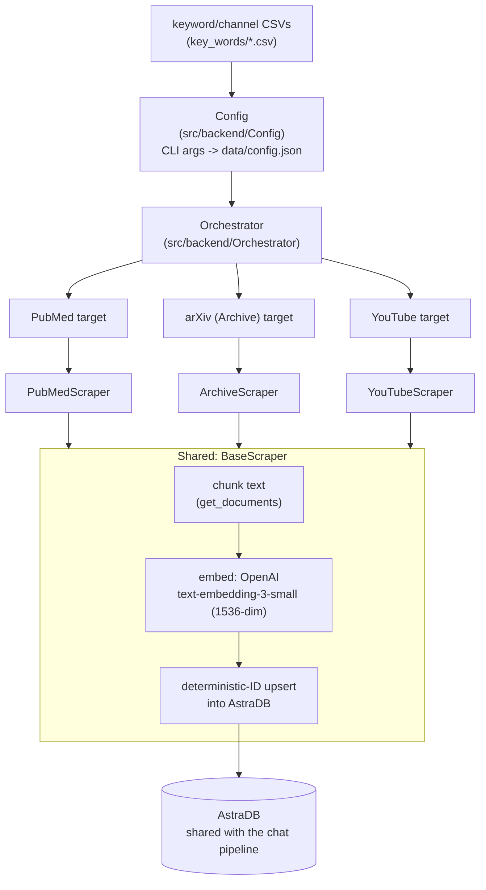
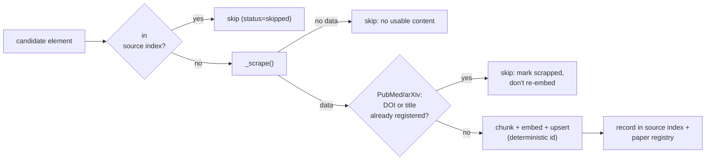

# 04 — Literature Ingestion Pipeline (Scrapers)

Owner code: [`Backend/scrapers/`](../../Backend/scrapers/).

## Purpose

A **standalone, offline batch pipeline** that has no runtime dependency on
the API or worker services and is not called by any request path. It exists
solely to keep the AstraDB vector collection stocked with general medical
reference material — PubMed papers, arXiv preprints, YouTube transcripts —
that the question-answering pipeline's paper-retrieval arm reads from at
query time (see
[doc 02, Component 2b](02_question_answering_pipeline.md#component-2b--research-paper-retrieval-chat_pipelinepaper_retrieverpy)).

This is the **only producer** into that AstraDB collection; the API is
strictly a read-only consumer of it.

## Architecture



- **Config** turns CLI args (targets, keywords, date range, category) into
  `data/config.json` — a serialized list of `ArchiveTarget`/`PubMedTarget`/
  `YouTubeTarget` entries.
- **Orchestrator** runs each configured target and isolates per-item
  failures: one bad paper or video raising an exception is logged and
  recorded as `failed` in a status file — it does not abort the run for the
  remaining items (`Orchestrator.run`/`run_target` both wrap each element in
  its own `try/except`).
- **Scrapers** (`PubMedScraper`, `ArchiveScraper`, `YouTubeScraper`) fetch and
  normalize source-specific content; **`BaseScraper`** owns everything
  source-agnostic: chunking into `Document`s, embedding, and the
  deterministic AstraDB upsert.

## Idempotency and dedup — three independent layers

This pipeline runs unattended once a month against sources that don't
guarantee stability between runs, so its dedup story is deliberately
defense-in-depth rather than a single check:

1. **Per-source index** (`data/{source}/index.json`) — before scraping an
   element, `is_scrapped()` checks whether its id is already recorded;
   `scrape_and_save()` re-checks the same index right before saving, so a
   duplicate target appearing in one config run, or a direct call bypassing
   discovery, still can't double-process.
2. **Cross-source paper registry** (`data/papers/index.json`) — PubMed and
   arXiv both feed the same conceptual corpus (scholarly papers), so the same
   paper found through both sources must not be embedded twice.
   `_paper_duplicate` checks by **DOI first, then a normalized-title SHA-256
   fingerprint** as a fallback for papers without a usable DOI. A hit marks
   the *new* source as scrapped (so it isn't retried every run) without
   re-embedding.
3. **Deterministic AstraDB vector IDs** — every chunk's id is
   `SHA256(f"{scraper_class}:{element_id}:{chunk_index}")`. Even if the
   local index files were ever lost, re-running the pipeline **upserts** the
   same vectors rather than creating duplicates — this is the backstop under
   the other two layers, not a replacement for them (re-embedding still costs
   OpenAI API spend even though it doesn't create duplicate vectors).



Upsert retries (`_save_vector_docs`) tolerate AstraDB's serverless gateway
returning transient 400/429/500/502/503/504 errors (observed: openresty
gateway errors while the DB wakes from idle or is under load) with a
`0s → 2s → 4s → 8s` backoff before giving up — a genuine bad request also
returns as one of those codes but simply exhausts the retries and raises, so
this doesn't mask real errors, only ride out real transience.

## Metadata schema (the contract with the QA pipeline)

Every chunk is stored with a fixed metadata shape, and this is the **exact**
contract [doc 02](02_question_answering_pipeline.md)'s paper-retrieval arm
filters and reads:

```json
{
  "domain": "medical",
  "sub_domain": "oncology",
  "category": "optional free-form tag",
  "query_keywords": ["..."],
  "document_keywords": ["..."],
  "source": "archive | pubmed | youtube",
  "source_type": "paper | video",
  "published_date": "ISO-8601 or empty",
  "ingested_at": "ISO-8601 timestamp",
  "source_id": "unique element id",
  "chunk_index": 0
}
```

`paper_retriever.py`'s `_vector_search` filters on `{"domain":
"medical", "sub_domain": "oncology"}` — currently hardcoded because every
onboarded patient today is an oncology patient. Adding a new
domain/sub-domain is purely a **scraper-config-time decision**
(`--domain`/`--sub-domain` flags at scrape time); no scraper code change is
needed, only a corresponding update to the query-side filter once the API
needs to serve that domain too.

## The embedding-model coupling (a documented footgun, already hit once)

The query-side embedding model (`api/chat_pipeline/astra_client.py`) **must**
match the ingestion-side model (`base_scraper.py`) exactly —
`text-embedding-3-small`, both hardcoded rather than left to library
defaults. This is called out explicitly in both files' docstrings because it
already broke in practice: an earlier version of the query-side client
relied on `OpenAIEmbeddings()`'s implicit default
(`text-embedding-ada-002`), which silently does **not** match what the
scraper used. Mixing embedding spaces doesn't raise an error — cosine
similarity between a stored vector and a fresh embedding of its own content
came back ~0.02 (statistically random) instead of ~1.0, i.e. retrieval
silently returned garbage. Both files now pass `model=` explicitly rather
than relying on a library default, specifically to prevent this from
regressing silently again.

## Deployment: Cloud Run Job, not a service

Unlike the API and worker (long-running Cloud Run **services**), this
pipeline is a run-to-completion **Cloud Run Job**, triggered monthly by Cloud
Scheduler (`0 3 1 * *` — 03:00 UTC on the 1st) — see
[doc 05](05_infrastructure_and_deployment.md) for the shared deployment
patterns across all three compute units.

State persistence across runs matters here specifically because the dedup
layers above are files, not a database: `run_monthly.py` syncs the entire
`data/` tree (source indexes + paper registry) to/from
`gs://ailixir-scraper-state-<project>` before and after each run. Losing that
bucket doesn't cause data corruption (AstraDB's deterministic IDs still
prevent duplicate vectors) but it does make every subsequent run re-scrape
and re-embed everything from scratch — a real cost since YouTube in
particular has no date filter and depends entirely on its persisted index to
know what's new.
