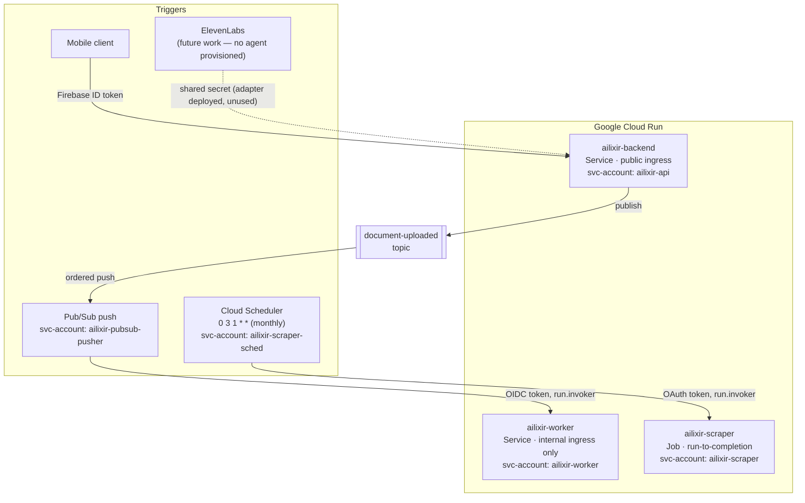
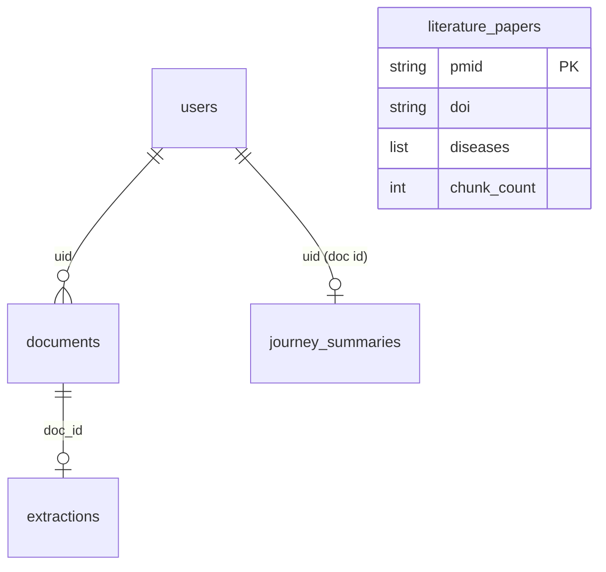
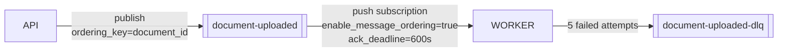

# 05 — Infrastructure & Deployment

Owner code: `Backend/api/terraform/`, `Backend/workers/terraform/`,
`Backend/scrapers/terraform/`. All three are **independent Terraform
states**, sharing one GCS state bucket (`amos2026ss03-ailixir-tf-state`) with
different prefixes, so any one of them can be planned/applied without
locking the others.

## Compute topology



Only the API service has public (`allUsers`) invoker access
(`google_cloud_run_v2_service_iam_member.backend_public` in
`api/terraform/main.tf`). The worker's only invoker is the
`ailixir-pubsub-pusher` service account, and its Cloud Run ingress is
additionally restricted to internal + load-balancer traffic — two
independent layers (network ingress *and* IAM invoker binding) rather than
relying on OIDC verification alone.

## Service accounts and IAM

Each compute unit runs as its own service account with narrowly scoped
roles — no shared "do everything" identity:

| Service account | Runs | Key roles | Why |
|---|---|---|---|
| `ailixir-api` | API service | `roles/datastore.user`, `roles/pubsub.publisher` (document-uploaded topic only), `roles/firebaseauth.admin`, `roles/aiplatform.user`, `roles/discoveryengine.viewer`, `roles/storage.objectAdmin` (documents bucket), `roles/storage.objectViewer` (cypher bucket), `roles/iam.serviceAccountTokenCreator` (on itself) | Firestore reads/writes, publish events, admin-create Firebase users, chat pipeline Gemini + rerank calls, sign v4 URLs without a private key, read worker-produced Cypher files |
| `ailixir-worker` | Worker service | `roles/datastore.user`, `roles/storage.objectViewer` (documents bucket only), `roles/storage.objectAdmin` (cypher bucket only), `roles/aiplatform.user` | Read uploaded files, write Cypher exports, run Gemini/Graphiti |
| `ailixir-pubsub-pusher` | *(token minter, not compute)* | `roles/run.invoker` on the worker service only | Lets Pub/Sub sign OIDC tokens the worker will accept, without being a Cloud Run principal itself |
| `ailixir-scraper` | Scraper Job | `roles/storage.objectAdmin` (scraper state bucket only) | Persist dedup indexes between monthly runs |
| `ailixir-scraper-sched` | *(token minter, not compute)* | `roles/run.invoker` on the scraper Job only | Lets Cloud Scheduler execute the Job |

Notice the pattern repeated three times: **the account that *signs a token*
for cross-service calls is a different, narrower principal than the account
that *runs the workload*** (`ailixir-pubsub-pusher` vs `ailixir-worker`,
`ailixir-scraper-sched` vs `ailixir-scraper`). A compromised worker container
can't mint new pusher tokens; a compromised scraper container can't
re-trigger itself via the scheduler identity.

Two bucket-level grants exist purely to let one service read what the *other*
service's account wrote:

- `api_cypher_viewer` — the API needs `storage.objects.get` on the cypher
  bucket (owned/written by the worker) purely to sign v4 GET URLs for
  `.cypher` files; v4 signed URLs carry the **signer's** identity in the
  signature, so without this grant the signed URL the API hands back to the
  frontend 403s.
- `worker_cypher_admin` — the worker needs *write* access to the same
  bucket to actually produce those files.

## Data stores

| Store | What it holds | Written by | Read by |
|---|---|---|---|
| **Firestore** | `documents`, `extractions`, `journey_summaries`, `users`, `literature_papers` collections | API (`documents`, `users`), Worker (`extractions`, `journey_summaries`, document status fields) | API (all, for its own responses) |
| **GCS — documents bucket** (`ailixir-documents-<project>`) | Raw uploaded files, per-user prefixed (`users/{uid}/documents/{doc_id}/{file_id}.{ext}`) | Mobile client (direct signed PUT) | Worker (download for analysis), API (signs download URLs) |
| **GCS — cypher bucket** (`ailixir-cypher-<project>`) | Exported `.cypher` graph scripts, 90-day lifecycle deletion | Worker | API (signs download URLs for the frontend) |
| **GCS — scraper state bucket** (`ailixir-scraper-state-<project>`) | `data/` tree: per-source dedup indexes, cross-source paper registry | Scraper Job | Scraper Job (next run) |
| **Neo4j (Aura)** | Per-patient temporal knowledge graph, via Graphiti | Worker (`add_episode`) | Worker (Cypher export queries), API (chat retrieval, `group_id`-scoped) |
| **AstraDB** | Vector store of chunked research-paper/video content | Scraper Job | API (chat paper-retrieval arm) |

Firestore collection relationships, at a glance:



`literature_papers` is intentionally disconnected from the per-user
collections above — it's a *global* dedup ledger for the scraper subsystem
(keyed by PubMed ID, not by user), sitting in the same Firestore project only
for operational convenience.

## Pub/Sub topology



Message ordering is enabled at both the publisher (`shared/pubsub.py`,
`PublisherOptions(enable_message_ordering=True)`) and the subscription
(`enable_message_ordering = true` in `workers/terraform/main.tf`) — both
sides must agree, and the topic + subscription live in **different**
Terraform states (`api/` publishes to the topic by name; the subscription
that owns delivery semantics is declared in `workers/`), which is why the
worker's `main.tf` hardcodes the API's service account email as a string
rather than doing a cross-state `data` lookup — avoiding a hard apply-order
dependency between the two states (see the comment in
`workers/terraform/main.tf`).

Retry policy: `10s → 600s` exponential backoff, `max_delivery_attempts = 5`
before a message is routed to `document-uploaded-dlq` for manual inspection.
`ack_deadline_seconds = 600` gives the worker up to 10 minutes per delivery
attempt — generous headroom over the pipeline's typical wall time (dominated
by the Gemini pacing described in
[doc 01](01_extraction_and_knowledge_graph_pipeline.md#why-every-gemini-call-in-this-service-is-paced)).

## Region layout

| Resource | Region | Why |
|---|---|---|
| Cloud Run services/job | `us-east1` (default; API/worker `var.region`) | Primary deployment region |
| Vertex AI (Gemini + embeddings) | `us-central1` (`VERTEX_LOCATION`), independent of Cloud Run region | Gemini models require `us-central1`; `us-east1` doesn't have them |
| Vertex AI Ranking API | `global` (`VERTEX_RANKING_LOCATION`) | `rankingConfigs` only exist at the `global` location |
| Firebase Realtime Database | `europe-west1` | Matches the project's existing RTDB instance (chat titles, chat metadata) |

Cloud Run workloads and the Vertex AI calls they make are in **different**
regions by necessity, not oversight — every `VERTEX_LOCATION` env var across
both services is set independently of `var.region`.

## Deployment model

All three compute units follow the same shape: **CI builds a Docker image
tagged with the git SHA, Terraform (re)applies with that tag as
`var.image_tag`.** From `Backend/README.md` and each service's own docs:

```
push to main → CI/CD pipeline → terraform apply (image_tag=<sha>) →
  Cloud Run creates/updates the revision → health check validates → live
```

- **API & Worker**: Cloud Run **services**, always-on (scale-to-zero capable),
  request/push-triggered.
- **Scraper**: Cloud Run **Job**, run-to-completion, triggered by Cloud
  Scheduler once a month (`0 3 1 * *`) via an OAuth-authenticated POST to the
  Cloud Run Admin API's `:run` endpoint. `max_retries = 1` on the Job itself
  (a second attempt is safe because of the dedup layers in
  [doc 04](04_literature_ingestion_pipeline.md)); a *separate* retry policy
  on the Scheduler job (`retry_count = 3`) only covers the trigger call
  failing to start the Job at all, not the Job's own work failing after it
  starts. A failed execution pages `alert_email` via Cloud Monitoring —
  deliberately, since a silent failure here means losing an entire month of
  literature ingestion before anyone notices.

### Local development

Both API and worker are run directly with `uvicorn` from the `Backend/`
directory (not from inside `api/` or `workers/`) so that the `shared/`
package resolves on the Python path:

```bash
cd Backend
uvicorn api.main:app --reload        # API on :8000 by default
uvicorn workers.main:app --reload --port 8080   # Worker
```

Both fall back to local credentials for GCP access
(`gcloud auth application-default login`) and honor Firestore/Auth emulator
env vars (`FIRESTORE_EMULATOR_HOST`, `FIREBASE_AUTH_EMULATOR_HOST`) for
running fully offline (`shared/firestore.py::_emulator_mode`). The worker
additionally supports `PUBSUB_SKIP_OIDC_VERIFICATION=1` to accept
unauthenticated push simulation locally — never set in a deployed
environment.
