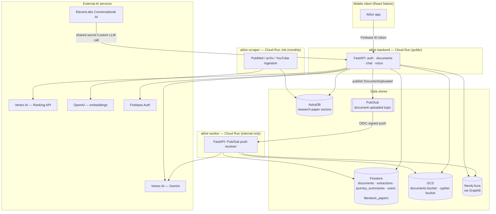

# Ailixir Backend — Architecture Documentation

Stage 1 of the project documentation effort. This folder describes **what the
backend actually is today** — not what an earlier plan said it would be. It
covers the two AI pipelines (document extraction + knowledge-graph
construction, and question answering) plus the API, the supporting literature
ingestion job, and how it's all deployed on GCP.

> **Scope note.** `code_components_diagram.*` and the `frontend_architecture_diagram`
> in this same folder pre-date this pass. `frontend_architecture_diagram` (the
> hand-drawn PNG of the voice/RTDB flow) is still accurate and is left as-is.
> `code_components_diagram.*` describes a planned multi-service/multi-domain
> layout (`/services`, `/workers`, `/packages`, `/domains`) that was never
> built — the real backend is the simpler two-service layout described below.

## Documents in this folder

| Doc | Covers |
|---|---|
| [01 — Extraction & Knowledge Graph Pipeline](01_extraction_and_knowledge_graph_pipeline.md) | Document upload → Gemini multimodal analysis → Graphiti/Neo4j knowledge graph → Cypher export. The asynchronous worker pipeline. |
| [02 — Question Answering Pipeline](02_question_answering_pipeline.md) | Chat + voice: contextualize → retrieve (knowledge graph + research papers) → answer. The synchronous, in-request RAG pipeline. |
| [03 — API Service Architecture](03_api_service_architecture.md) | FastAPI app structure, auth, documents CRUD/upload lifecycle, middleware, error model, security boundaries. |
| [04 — Literature Ingestion Pipeline](04_literature_ingestion_pipeline.md) | The standalone scraper job that fills the research-paper corpus the QA pipeline reads from. |
| [05 — Infrastructure & Deployment](05_infrastructure_and_deployment.md) | Cloud Run services/jobs, service accounts & IAM, data stores, Pub/Sub topology, Terraform layout. |

## System at a glance

The backend is **two Cloud Run services** talking through **Pub/Sub**, plus
**one Cloud Run Job** that runs monthly and feeds a shared vector store.

### The two pipelines

- **Extraction & Knowledge Graph pipeline** (async, worker-side): triggered
  once a document finishes uploading. Turns a PDF/image into a structured
  clinical narrative, then into graph nodes/edges in Neo4j, scoped per
  patient. See [doc 01](01_extraction_and_knowledge_graph_pipeline.md).
- **Question Answering pipeline** (sync, API-side): triggered on every chat
  or voice turn. Rewrites the query, pulls facts from the patient's graph
  and (optionally) reranked research-paper excerpts, then asks Gemini to
  answer. See [doc 02](02_question_answering_pipeline.md).

They are connected through Neo4j: the extraction pipeline **writes** the
graph, the QA pipeline **reads** it — always scoped to the same `group_id =
Firebase uid`, which is what keeps one patient's data invisible to another.

### Why two separate services instead of one

| | API service | Worker service |
|---|---|---|
| Trigger | HTTP request from the mobile client | Pub/Sub push (internal only) |
| Latency profile | Must respond within a user-perceived request | Minutes are fine; Pub/Sub retries absorb slowness |
| Public reachability | Yes (Cloud Run public ingress) | No (ingress restricted to internal + OIDC-verified) |
| Typical work | Auth, signed URLs, chat RAG | LLM document analysis, graph writes, Cypher export |

Splitting them means a slow or bursty LLM pipeline (worker) can never make
the user-facing API (auth, uploads, chat) slower or less available, and a
worker crash-loop can't take down login or chat.

### Tech stack summary

| Layer | Technology |
|---|---|
| API framework | FastAPI (both services), Uvicorn |
| Auth | Firebase Authentication (ID tokens), Firebase Admin SDK |
| Document store | Firestore |
| Blob storage | Google Cloud Storage (v4 signed URLs) |
| Async messaging | Google Cloud Pub/Sub (push, ordered, DLQ) |
| Knowledge graph | Neo4j (Aura), via [Graphiti](https://github.com/getzep/graphiti) |
| LLM | Gemini (via Vertex AI, `google-genai` SDK) |
| Vector store (papers) | AstraDB |
| Reranking | Vertex AI Ranking API (`discoveryengine`) |
| Paper embeddings | OpenAI `text-embedding-3-small` |
| Voice | ElevenLabs Conversational AI (Custom LLM integration) |
| Infra as code | Terraform, 3 independent states (`api/`, `workers/`, `scrapers/terraform/`) |
| Compute | Cloud Run (2 services) + Cloud Run Job (1, scheduled) |
