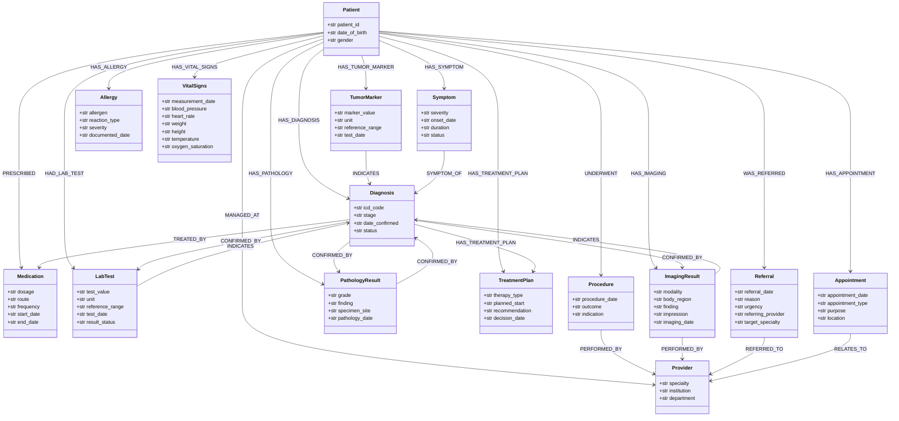

# Class Diagram — Medical Entity/Edge Schema

Source: `Backend/workers/pipeline/graph/medical_schema.py`. Prose reference:
[`code-components/05_workers_pipeline.md`](../code-components/05_workers_pipeline.md#pipelinegraphmedical_schemapy).

This is the fixed Pydantic schema passed to `graphiti.add_episode()` on
every ingestion call — it's what lets Graphiti merge the same `Patient`/
`Diagnosis`/`Medication` across multiple documents into one node instead of
creating a duplicate per upload, and enforce which relationship types are
legal between which entity pairs (`MEDICAL_EDGE_TYPE_MAP`).

All 15 entity classes and 20 edge classes extend `pydantic.BaseModel`
directly — no inheritance between them — so that single fact is noted once
here rather than drawn as 35 identical arrows below. Edge classes have empty
bodies; the class *name* is itself the semantic relationship label Graphiti
writes onto the graph edge. The associations below are exactly
`MEDICAL_EDGE_TYPE_MAP`, i.e. this is also an accurate map of what the
resulting Neo4j graph looks like.

