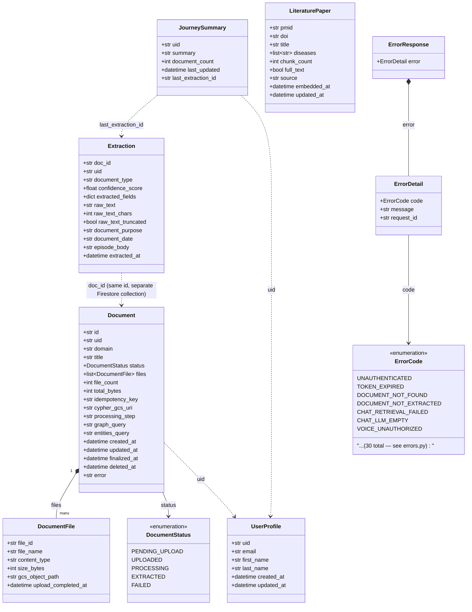

# Class Diagram — Domain Models (`shared/models/`)

Source: `Backend/shared/models/*.py`. Prose reference:
[`code-components/01_shared.md`](../code-components/01_shared.md#models-sharedmodels).
These are the Pydantic models both the API and worker services read/write to
Firestore.

