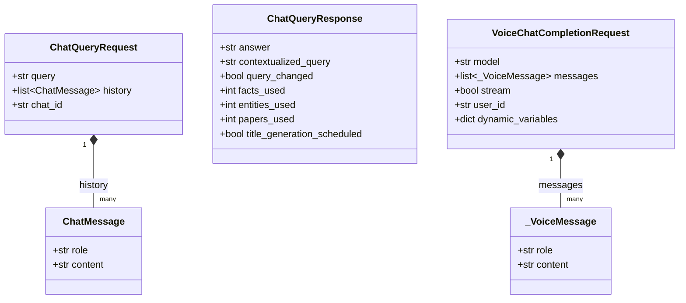

# Class Diagram — API Request/Response Models

Source: `Backend/api/main.py`, `Backend/api/chat.py`, `Backend/api/voice.py`.
Prose reference: [`code-components/02_api_core.md`](../code-components/02_api_core.md),
[`code-components/03_api_chat_pipeline.md`](../code-components/03_api_chat_pipeline.md).
These are the wire-format types the FastAPI app validates every request/response
against — effectively the API's contract with the mobile client. Field-level
detail (limits, examples) is in
[`api-integration-guides/Document_API_FE_Integration_guide.md`](../api-integration-guides/Document_API_FE_Integration_guide.md).

## Auth + Documents (`api/main.py`)

```mermaid
classDiagram
    class SignupRequest {
        +EmailStr email
        +str password
        +str first_name
        +str last_name
    }
    class SignupResponse {
        +str uid
        +EmailStr email
        +str first_name
        +str last_name
    }

    class CreateDocumentFileRequest {
        +str file_name
        +str content_type
        +int size_bytes
    }
    class CreateDocumentRequest {
        +str domain
        +str title
        +list~CreateDocumentFileRequest~ files
    }
    CreateDocumentRequest "1" *-- "many" CreateDocumentFileRequest : files

    class DocumentFileUploadInstruction {
        +str file_id
        +str file_name
        +str content_type
        +int size_bytes
        +str upload_method
        +str upload_url
        +dict upload_headers
        +datetime upload_expires_at
    }
    class CreateDocumentResponse {
        +str document_id
        +DocumentStatus status
        +str domain
        +str title
        +int file_count
        +int total_bytes
        +list~DocumentFileUploadInstruction~ files
        +datetime created_at
    }
    CreateDocumentResponse "1" *-- "many" DocumentFileUploadInstruction : files

    class RefreshUploadURLsResponse {
        +str document_id
        +DocumentStatus status
        +list~DocumentFileUploadInstruction~ files
    }
    RefreshUploadURLsResponse "1" *-- "many" DocumentFileUploadInstruction : files

    class DocumentFileResponse {
        +str file_id
        +str file_name
        +str content_type
        +int size_bytes
        +datetime upload_completed_at
        +str download_url
        +datetime download_expires_at
    }
    class DocumentResponse {
        +str document_id
        +DocumentStatus status
        +str domain
        +str title
        +int file_count
        +int total_bytes
        +list~DocumentFileResponse~ files
        +str cypher_gcs_uri
        +str cypher_download_url
        +str processing_step
        +str graph_query
        +str entities_query
        +str error
    }
    DocumentResponse "1" *-- "many" DocumentFileResponse : files

    class DocumentListItem {
        +str document_id
        +DocumentStatus status
        +str domain
        +str title
        +int file_count
        +str thumbnail_url
    }
    class ListDocumentsResponse {
        +list~DocumentListItem~ documents
        +str next_cursor
    }
    ListDocumentsResponse "1" *-- "many" DocumentListItem : documents

    class ExtractionResponse {
        +str doc_id
        +str document_type
        +float confidence_score
        +dict extracted_fields
        +str raw_text
        +str document_purpose
        +str document_date
        +str episode_body
        +datetime extracted_at
    }
```

## Chat (`api/chat.py`) and Voice (`api/voice.py`)

**Notes:**
- `ChatMessage` and `_VoiceMessage` look identical but are two separate
  classes — `chat.py`'s pipeline is Firebase-token-authenticated per user,
  `voice.py`'s is an OpenAI-shaped adapter for ElevenLabs with `extra="allow"`
  (accepts unknown fields), so they're kept decoupled rather than shared.
- `DocumentResponse`/`CreateDocumentResponse`/`RefreshUploadURLsResponse`
  all compose file-level response types but each with a *different* shape
  (`DocumentFileResponse` has download URLs, `DocumentFileUploadInstruction`
  has upload URLs) — they're response variants for different points in the
  same upload lifecycle, not the same type reused.

