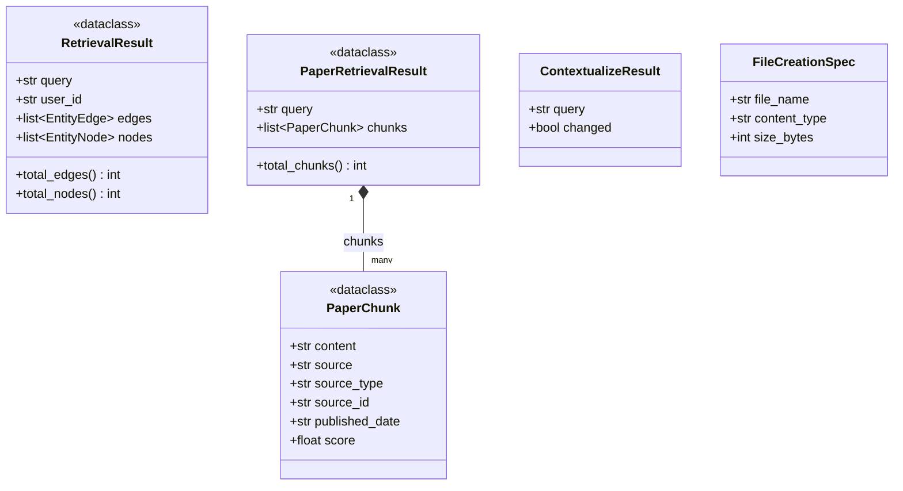
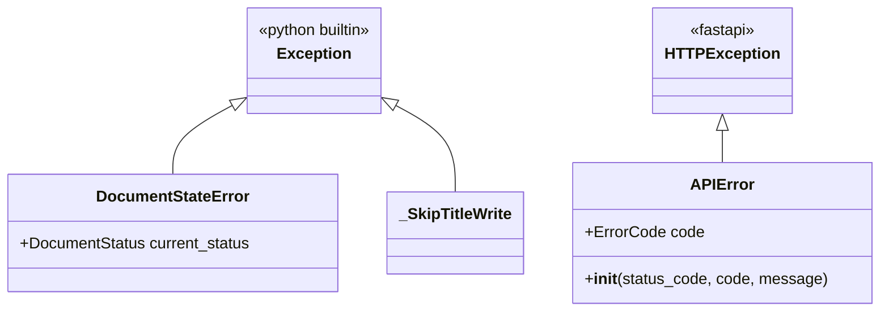
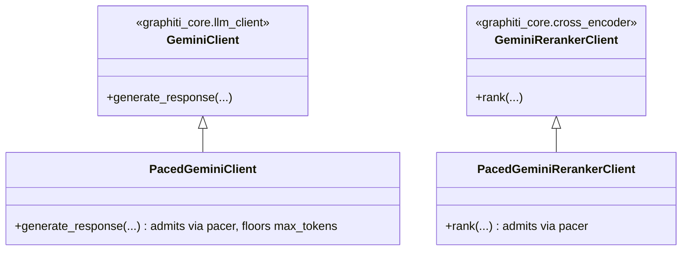

# Class Diagram — Runtime Classes (dataclasses, exceptions, subclassing)

Source: scattered across `Backend/api/chat_pipeline/`, `Backend/api/`,
`Backend/shared/`, `Backend/workers/connections/`. Prose reference:
[`code-components/01_shared.md`](../code-components/01_shared.md),
[`code-components/03_api_chat_pipeline.md`](../code-components/03_api_chat_pipeline.md),
[`code-components/04_workers_core.md`](../code-components/04_workers_core.md).

Everything elsewhere in the codebase is functions calling functions
(FastAPI routes, pipeline steps) — this page collects the handful of spots
where the code is genuinely object-oriented: dataclasses carrying
structured results between pipeline steps, custom exceptions, and the two
places a real subclass overrides real base-class behavior.

## Pipeline result dataclasses

`RetrievalResult` (from `retriever.py`) and `PaperRetrievalResult` (from
`paper_retriever.py`) are the two concurrent retrieval arms' outputs —
`answerer.py` takes one of each and merges them into the LLM prompt.
`ContextualizeResult` and `FileCreationSpec` use `__slots__` instead of
`@dataclass` (marginally cheaper, and neither needs `@dataclass`'s
auto-generated `__eq__`/`__repr__`), but are structurally the same idea:
a small, immutable-in-spirit bag of fields returned by one function and
consumed by its caller.

## Custom exceptions

- `APIError` (`api/errors.py`) is what every route raises for a domain-level
  failure — it carries the stable `ErrorCode` enum value alongside the HTTP
  status, which is what lets every error response share one JSON envelope
  shape (see `02_domain_models.md`'s `ErrorResponse`).
- `DocumentStateError` (`shared/repositories/documents.py`) is raised when a
  Firestore transaction finds the document in the wrong status for the
  requested transition (e.g. finalizing an already-finalized document).
- `_SkipTitleWrite` (`chat_pipeline/titler.py`) is a pure control-flow
  sentinel — raised *inside* a Realtime Database transaction callback purely
  to abort the write cleanly (chat already has a title, or was renamed by
  the user), never meant to propagate further.

## Subclassing Graphiti's Gemini clients (rate limiting)

