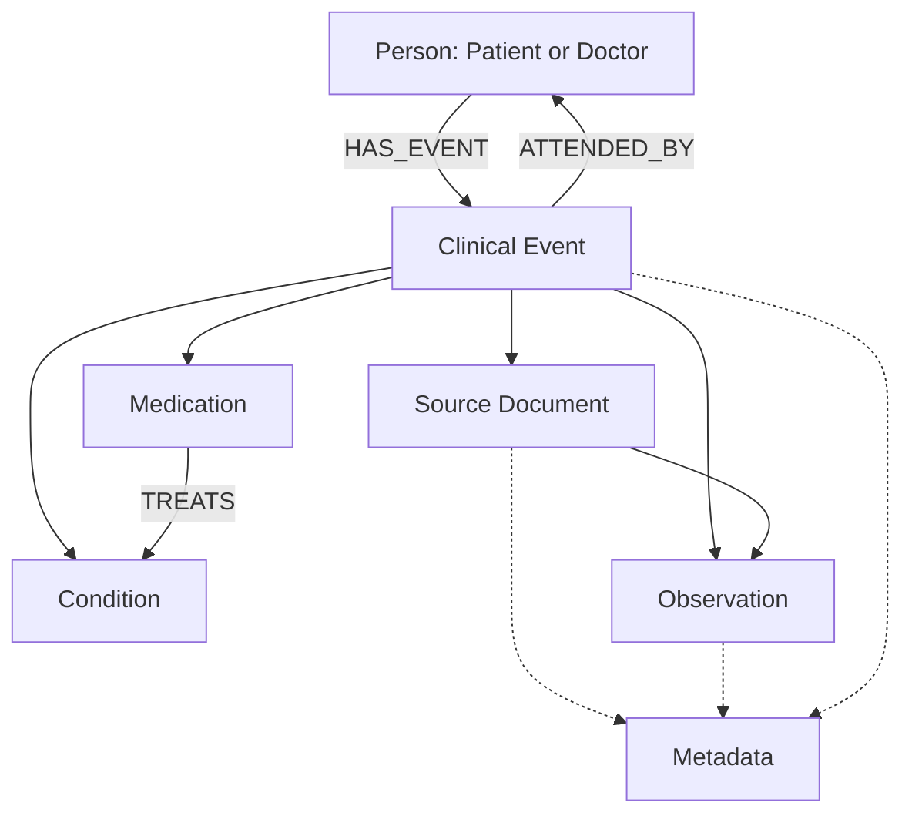

```mermaid
graph TD

    PERSON["Person: Patient or Doctor"]

    EVENT["Clinical Event"]

    CONDITION["Condition"]
    OBS["Observation"]
    MED["Medication"]

    DOC["Source Document"]
    META["Metadata"]

    %% =========================
    %% MAIN CLINICAL FLOW
    %% =========================

    PERSON -->|HAS_EVENT| EVENT

    EVENT --> CONDITION
    EVENT --> OBS
    EVENT --> MED

    MED -->|TREATS| CONDITION

    %% =========================
    %% PROVENANCE
    %% =========================

    EVENT -->|ATTENDED_BY| PERSON
    EVENT --> DOC
    DOC --> OBS

    %% =========================
    %% METADATA (LIGHTWEIGHT)
    %% =========================

    DOC -.-> META
    OBS -.-> META
    EVENT -.-> META
```